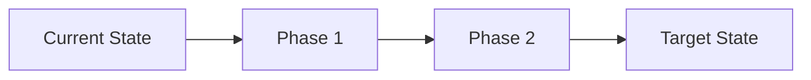

# Trinity Method SDK Architecture

**Trinity Method v2.1.0**
**Technology Stack**: JavaScript/TypeScript
**Framework**: Node.js
**Last Updated**: 2026-02-25

---

## SYSTEM OVERVIEW

### Technology Profile

```JavaScript/TypeScript
const trinitymethodsdkStack = {
  framework: 'Node.js v18+',
  language: 'TypeScript 5.9',
  runtime: 'Node.js',
  database: 'None (CLI tool)',
  authentication: 'None (local CLI)',
  styling: 'Chalk (terminal colors)',
  testing: 'Jest v30',
  buildTool: 'TypeScript Compiler (tsc)',
  deployment: 'npm registry',
  linting: 'ESLint v9',
  formatting: 'Prettier v3'
};
```

### Repository Structure

```
Trinity Method SDK/
├── src/
│   ├── cli/                    # CLI commands (deploy, update, version)
│   │   ├── commands/          # Command implementations
│   │   └── utils/             # CLI utilities (metrics, deploy, linting)
│   ├── templates/             # Trinity templates (88 production components)
│   │   ├── .claude/          # Agent & command templates
│   │   ├── trinity/          # Knowledge base, work orders, documentation
│   │   ├── root/             # Root files (CLAUDE.md, linting configs)
│   │   ├── source/           # Framework-specific CLAUDE.md variants
│   │   └── ci/               # CI/CD workflow templates
│   └── index.ts              # Main entry point
├── tests/
│   ├── unit/                  # Unit tests (67% coverage baseline)
│   ├── integration/          # Integration tests (100% coverage)
│   └── helpers/              # Test utilities (Windows file locking fixes)
├── trinity/                   # Project's own Trinity deployment
│   ├── knowledge-base/       # Living documentation
│   ├── archive/              # Archived work orders and reports
│   ├── sessions/             # Active session work (empty after /trinity-end)
│   └── reports/              # Session reports (empty after /trinity-end)
├── docs/
│   ├── api/                  # API documentation (42 files, 12,066 lines)
│   ├── guides/               # User guides
│   └── reference/            # CLI reference
├── scripts/                   # Build and verification scripts
└── .github/workflows/        # CI/CD pipelines (BAS 6-phase quality gates)
```

---

## COMPONENT ARCHITECTURE

### Core Components

| Component               | Responsibility                                      | Dependencies        | Status        |
| ----------------------- | --------------------------------------------------- | ------------------- | ------------- |
| **CLI Commands**        | Deploy, update, version management                  | Commander.js        | ✅ Production |
| **Template System**     | 88 production components deployment                 | fs-extra, path      | ✅ Production |
| **Metrics Collection**  | Code quality, complexity, framework detection       | Various             | ✅ Production |
| **Deploy Utils**        | CI/CD, linting, directory management                | fs-extra, chalk     | ✅ Production |
| **Trinity-Docs-Update** | Autonomous documentation maintenance (v2.1.0)       | JUNO + 3 APO agents | ✅ Production |
| **JUNO Auditor**        | Quality gate validation, audit orchestration        | Template system     | ✅ Production |
| **Test Infrastructure** | Windows-safe cleanup, mock deployments              | Jest, fs-extra      | ✅ Production |
| **Update Migration**    | Legacy pre-2.2.0 deployment detection and migration | fs-extra            | ✅ Production |

### Node.js CLI Architecture

- **Component Pattern**: Modular CLI with command pattern (Commander.js)
- **State Management**: File-based state (VERSION, .trinity-backup/)
- **Command Routing**: Commander.js with subcommands (deploy, update, version)
- **Data Flow Pattern**: Template → Process → Deploy → Verify
- **Error Handling**: Custom error classes (TrinityError hierarchy)
- **Platform Support**: Cross-platform (Windows, macOS, Linux with platform-specific handling)

### Integration Points

```yaml
Internal_Integrations:
  - Component: CLI Commands
    Protocol: Function calls
    Data_Format: TypeScript interfaces

  - Component: Template System
    Protocol: File system operations
    Data_Format: Markdown templates with {{PLACEHOLDER}} syntax

  - Component: Metrics Collection
    Protocol: File analysis + git operations
    Data_Format: JSON metrics objects

  - Component: JUNO + APO Agents
    Protocol: Command invocation via templates
    Data_Format: Markdown checklists + reports

External_Integrations:
  - Service: npm Registry
    API_Type: npm publish/install
    Authentication: npm tokens (deployment only)

  - Service: Git
    API_Type: CLI commands (git log, git status)
    Authentication: User's git credentials

  - Service: GitHub Actions / GitLab CI
    API_Type: YAML workflow files
    Authentication: Repository secrets
```

---

## TRINITY-DOCS-UPDATE ARCHITECTURE (v2.1.0)

### Overview

**Purpose**: Autonomous documentation maintenance system ensuring docs reflect codebase reality
**Command**: `/trinity-docs-update`
**Architecture**: JUNO audit → 3 parallel APOs → Verification loop

### Phase Architecture

#### Phase 0: Pre-Flight Check

```typescript
interface PreFlightCheck {
  docsDirectory: boolean; // Verify docs/ exists
  stateInit: {
    completedDocs: string[]; // Track completed documentation
    activeIssues: Issue[]; // Track discovered issues
  };
}
```

#### Phase 1: JUNO Comprehensive Audit

**Agent**: JUNO (Quality Auditor)
**Checklist**: `juno-docs-update-checklist.md` (1,337 lines)

**Audit Scope**:

1. **Database Verification Protocol**:
   - Detect database presence (PostgreSQL, MySQL, SQLite, Docker)
   - **MANDATORY**: Attempt production connection
   - Document connection attempt (success or failure)
   - Schema source: Production DB (preferred) or schema files (fallback)

2. **Environment Configuration Verification**:
   - Detect .env files
   - Verify environment variables against codebase
   - Prevent false positives (check actual usage)
   - Document configuration patterns

3. **Codebase Analysis**:
   - Architecture-level business logic discovery
   - Module-level pattern identification
   - Function-level implementation details
   - API endpoint documentation
   - Integration point mapping

**Output**: Comprehensive audit report with task distribution

#### Phase 2: APO Documentation Updates (Parallel Execution)

**Agents**: APO-1, APO-2, APO-3 (3 parallel instances)
**Checklist**: `apo-docs-update-checklist.md` (343 lines each)

**Task Distribution**:

```yaml
APO-1:
  - Primary: Architecture-level docs
  - Secondary: API documentation
  - Tertiary: Configuration guides

APO-2:
  - Primary: Module-level docs
  - Secondary: Integration guides
  - Tertiary: Testing documentation

APO-3:
  - Primary: Function-level docs
  - Secondary: Environment setup
  - Tertiary: Deployment guides
```

**Verification Requirements** (per APO):

- Every claim MUST be codebase-backed
- Code examples MUST be valid and tested
- No hallucinations tolerated (100% accuracy requirement)
- Read actual source files before documenting
- Cross-reference with JUNO audit findings

**Execution Mode**: Autonomous (no user stops/questions between phases)

#### Phase 3: JUNO Verification Loop

**Agent**: JUNO (Quality Auditor)
**Purpose**: Ensure 100% task completion and quality

**Verification Loop**:

```typescript
do {
  // Step 1: Completion Verification
  const completionReport = verifyAllTasksComplete();

  if (!completionReport.allComplete) {
    // Step 2: Quality Audit
    const qualityReport = auditCompletedDocs();

    // Step 3: Issue Detection
    const issues = detectIncompleteOrInaccurate(completionReport, qualityReport);

    // Step 4: Issue Fixing (assign to APO-1, APO-2, or APO-3)
    await fixIssuesInParallel(issues);

    continue; // Restart verification loop
  }

  // All tasks complete and verified
  break;
} while (true);
```

**Quality Gates**:

- ✅ All JUNO tasks completed
- ✅ All APO tasks completed
- ✅ 100% codebase accuracy
- ✅ No placeholder content
- ✅ All code examples valid
- ✅ Cross-references correct

**Output**: Final audit report with metrics

### Database Verification Protocol (Critical Path)

**Zero-Tolerance Policy**: If database detected → production connection MUST be attempted

**Detection Methods**:

```bash
# 1. Check for ORM dependencies
npm list sequelize typeorm prisma mongoose

# 2. Check for database drivers
npm list pg mysql2 sqlite3 mongodb

# 3. Check for schema files
find . -name "*.prisma" -o -name "*schema*.sql" -o -name "migrations/*"

# 4. Check for database config
cat config/database.yml config/database.js .env | grep -i database
```

**Connection Attempt Requirements**:

```yaml
PostgreSQL:
  Command: psql -h $HOST -U $USER -d $DATABASE -c "\dt"
  Fallback: Check docker containers
  Documentation: Record connection attempt result

MySQL:
  Command: mysql -h $HOST -u $USER -p -D $DATABASE -e "SHOW TABLES;"
  Fallback: Check docker containers
  Documentation: Record connection attempt result

SQLite:
  Command: sqlite3 $DATABASE_FILE ".schema"
  Fallback: Check for .db/.sqlite files
  Documentation: Record schema extraction

Docker:
  Command: docker exec $CONTAINER psql -U $USER -d $DATABASE -c "\dt"
  Detection: docker ps | grep -i postgres|mysql|mongo
  Documentation: Record container access
```

**False Positive Prevention**:

- Dependency installed ≠ Database used
- .env variable present ≠ Variable used
- Must verify actual usage in codebase
- Check for database queries/models

### Accuracy Verification Requirements

**100% Accuracy Standard** (not 90%, not 95%):

1. **No Hallucinations**: Every component mentioned must exist in codebase
2. **No Outdated Info**: Documentation reflects current state
3. **Valid Code Examples**: All examples compile/run
4. **Correct Cross-References**: Links point to existing files/sections
5. **Codebase-Backed Claims**: Every statement verified against source code

**Verification Method**:

```typescript
// APO must read actual files
const sourceCode = await readFile('src/component.ts');
const documentation = generateDocs(sourceCode); // ✅ Codebase-backed

// NOT acceptable
const documentation = 'Based on common patterns...'; // ❌ Hallucination
```

### Coordination & Communication

**Autonomous Execution**:

- No user stops between phases
- No questions during execution
- Self-contained decision-making
- Issue resolution without external input

**Agent Communication**:

```yaml
JUNO → APO:
  - Task assignments via audit report
  - Task completion verification
  - Issue reports for fixing

APO → JUNO:
  - Task completion signals
  - Documentation outputs
  - Blocker reports (database access, etc.)

APO ↔ APO:
  - Minimal (independent execution)
  - Cross-references coordinated via JUNO
```

### Metrics & Reporting

**Tracked Metrics**:

- Total documentation files processed
- Files created vs updated vs unchanged
- Codebase verification count (file reads)
- Database connection attempts
- Environment variable verifications
- Issues detected and resolved
- Verification loop iterations
- Total execution time

**Success Criteria**:

- ✅ JUNO verification loop exits (100% complete)
- ✅ All database connections attempted and documented
- ✅ All environment variables verified
- ✅ Zero placeholder content remaining
- ✅ All code examples validated
- ✅ Cross-references verified

---

## DATA ARCHITECTURE

### Data Models

```JavaScript/TypeScript
// Core data structures
{{DATA_MODEL_EXAMPLE}}
```

### Database Schema

- **Primary Database**: {{DATABASE_TYPE}}
- **Schema Version**: {{SCHEMA_VERSION}}
- **Migration Strategy**: {{MIGRATION_STRATEGY}}

### Data Flow

1. **Input Layer**: {{INPUT_DESCRIPTION}}
2. **Processing Layer**: {{PROCESSING_DESCRIPTION}}
3. **Storage Layer**: {{STORAGE_DESCRIPTION}}
4. **Output Layer**: {{OUTPUT_DESCRIPTION}}

---

## API ARCHITECTURE

### API Design Pattern

- **Pattern**: {{API_PATTERN}} (REST/GraphQL/RPC)
- **Version**: {{API_VERSION}}
- **Documentation**: {{API_DOCS_LOCATION}}

### Endpoint Structure

```
{{API_BASE_URL}}/
├── /auth/              # Authentication endpoints
├── /api/v1/           # Main API endpoints
├── /admin/            # Administrative endpoints
└── /health/           # Health check endpoints
```

### Authentication & Authorization

- **Auth Method**: {{AUTH_METHOD}}
- **Token Type**: {{TOKEN_TYPE}}
- **Session Management**: {{SESSION_MANAGEMENT}}
- **Permission Model**: {{PERMISSION_MODEL}}

---

## PERFORMANCE ARCHITECTURE

### Performance Baselines

```yaml
Performance_Targets:
  Initial_Load: <{{LOAD_TIME_TARGET}}ms
  API_Response: <{{API_RESPONSE_TARGET}}ms
  Database_Query: <{{DB_QUERY_TARGET}}ms
  Memory_Usage: <{{MEMORY_TARGET}}MB
  CPU_Usage: <{{CPU_TARGET}}%
```

### Optimization Strategies

1. **Caching**: {{CACHING_STRATEGY}}
2. **Bundle Optimization**: {{BUNDLE_STRATEGY}}
3. **Lazy Loading**: {{LAZY_LOADING_STRATEGY}}
4. **Database Indexing**: {{INDEXING_STRATEGY}}

### Monitoring Points

- Application Performance Monitoring (APM)
- Error tracking and alerting
- Performance metrics dashboard
- User experience metrics

---

## SECURITY ARCHITECTURE

### Security Layers

1. **Network Security**: {{NETWORK_SECURITY}}
2. **Application Security**: {{APP_SECURITY}}
3. **Data Security**: {{DATA_SECURITY}}
4. **Infrastructure Security**: {{INFRA_SECURITY}}

### Security Measures

```yaml
Input_Validation:
  - Type: { { VALIDATION_TYPE } }
  - Library: { { VALIDATION_LIBRARY } }

Encryption:
  - At_Rest: { { ENCRYPTION_AT_REST } }
  - In_Transit: { { ENCRYPTION_IN_TRANSIT } }

Access_Control:
  - Method: { { ACCESS_CONTROL_METHOD } }
  - Granularity: { { ACCESS_GRANULARITY } }
```

---

## DEPLOYMENT ARCHITECTURE

### Deployment Environment

- **Development**: {{DEV_ENVIRONMENT}}
- **Staging**: {{STAGING_ENVIRONMENT}}
- **Production**: {{PROD_ENVIRONMENT}}

### CI/CD Pipeline (BAS 6-Phase Quality Gates)

**File**: `.github/workflows/ci.yml` (1,350 lines)
**Platforms**: Ubuntu, Windows, macOS
**Node.js Versions**: 18.x, 20.x, 22.x

```yaml
BAS_6_Phase_Quality_Gates:
  Phase_1_Code_Quality:
    - ESLint with --fix
    - TypeScript type checking (tsc --noEmit)
    - Prettier formatting validation

  Phase_2_Structure_Validation:
    - Template directory structure (13 required directories)
    - Agent templates (19 agents across 5 categories)
    - Slash commands (20 commands across 7 categories)
    - Knowledge base templates (9 files)
    - Investigation templates (5 files: bug, feature, performance, security, technical)
    - Work order templates (6 files)
    - Documentation templates (25 files)
    - Root templates (2 files: CLAUDE.md, TRINITY.md)
    - Source CLAUDE.md variants (7 frameworks)
    - Linting configurations (13 templates for 4 frameworks)
    - CI/CD templates (2 files: ci.yml, cd.yml)
    - Total validation: 88 production components + 13 linting configs

  Phase_3_Build_Validation:
    - TypeScript compilation (npm run build)
    - Build artifact verification (scripts/verify-build.cjs)
    - Template copy verification (dist/templates/)
    - TypeScript declarations generated

  Phase_4_Testing:
    - Unit tests (Jest)
    - Integration tests (Jest)
    - Multi-platform testing (Windows, macOS, Linux)
    - Performance tests (critical path timing)

  Phase_5_Coverage_Check:
    - Lines: ≥75% threshold
    - Branches: ≥65% threshold
    - Functions: ≥80% threshold
    - Statements: ≥75% threshold
    - Fail build if below thresholds

  Phase_6_Documentation:
    - API docs generation (TypeDoc)
    - README validation
    - CHANGELOG validation
    - Template documentation verification
```

**Critical Commands Validation**:

- trinity-init (Infrastructure bootstrap)
- trinity-start (Session initialization)
- trinity-orchestrate (Work order execution)
- trinity-audit (Quality validation)
- trinity-docs (Documentation maintenance)
- trinity-docs-update (NEW in v2.1.0 - Autonomous doc updates)

### Infrastructure

- **Hosting**: {{HOSTING_PROVIDER}}
- **Container**: {{CONTAINER_TECH}}
- **Orchestration**: {{ORCHESTRATION}}
- **Monitoring**: {{MONITORING_TOOLS}}

---

## SCALABILITY ARCHITECTURE

### Current Capacity

- **Users**: {{CURRENT_USER_CAPACITY}}
- **Requests/sec**: {{CURRENT_RPS}}
- **Data Volume**: {{CURRENT_DATA_VOLUME}}

### Scaling Strategy

1. **Horizontal Scaling**: {{H_SCALING_STRATEGY}}
2. **Vertical Scaling**: {{V_SCALING_STRATEGY}}
3. **Database Scaling**: {{DB_SCALING_STRATEGY}}
4. **Caching Layer**: {{CACHE_SCALING_STRATEGY}}

### Bottleneck Analysis

| Component        | Current Limit | Scaling Solution | Priority       |
| ---------------- | ------------- | ---------------- | -------------- |
| {{BOTTLENECK_1}} | {{LIMIT_1}}   | {{SOLUTION_1}}   | {{PRIORITY_1}} |
| {{BOTTLENECK_2}} | {{LIMIT_2}}   | {{SOLUTION_2}}   | {{PRIORITY_2}} |

---

## TESTING ARCHITECTURE

### Test Strategy

```yaml
Test_Coverage_Actual:
  Overall_Coverage: 67% (baseline established)
  Unit_Tests: 100% (7 utility modules)
  Integration_Tests: 100% (44 tests)
  Total_Tests: 214 tests (40 obsolete tests removed in v2.0)

Test_Coverage_Targets:
  Lines: ≥75%
  Branches: ≥65%
  Functions: ≥80%
  Statements: ≥75%

Test_Execution:
  Pre_Commit: Husky hook → lint-staged → ESLint + Prettier
  Pre_Push: All tests via CI
  Pull_Request: Multi-platform (Ubuntu, Windows, macOS) + Multi-Node.js (18, 20, 22)
  Main_Branch: Full regression + coverage enforcement
```

### Testing Framework

- **Unit Testing**: Jest v30 with ts-jest
- **Integration Testing**: Jest v30 (filesystem operations)
- **E2E Testing**: Integration tests with mock deployments
- **Performance Testing**: Manual timing of critical paths
- **Platform Testing**: Windows file locking specific tests

### Windows File Locking Handling (v2.1.0)

**Issue**: Windows async file locking causes EBUSY/EPERM errors in test cleanup
**Solution**: Retry logic with exponential backoff

```typescript
// tests/helpers/test-helpers.ts
export async function cleanupTempDir(dir: string): Promise<void> {
  const maxRetries = 3;
  const retryDelay = 100; // ms

  for (let i = 0; i < maxRetries; i++) {
    try {
      await fs.remove(dir);
      return; // Success
    } catch (error: unknown) {
      const err = error as { code?: string };
      if (i < maxRetries - 1 && (err.code === 'EBUSY' || err.code === 'EPERM')) {
        await new Promise((resolve) => setTimeout(resolve, retryDelay * (i + 1)));
        continue;
      }
      throw error; // Last retry or different error
    }
  }
}
```

### Test Helpers (v2.1.0)

**File**: `tests/helpers/test-helpers.ts`

**Functions**:

- `cleanupTempDir(dir)` - Windows-safe directory cleanup with retry logic
- `createMockTrinityDeployment()` - Creates mock Trinity structure
- `verifyTrinityStructure()` - Validates Trinity deployment
- `readVersion()` - Reads Trinity version from deployment
- `verifyUserFilesPreserved()` - Checks user file preservation
- `countFiles(dir)` - Recursively counts files
- `createMockPackageJson()` - Creates mock package.json with version

---

## MAINTENANCE ARCHITECTURE

### Logging Strategy

- **Log Levels**: {{LOG_LEVELS}}
- **Log Aggregation**: {{LOG_AGGREGATION}}
- **Log Retention**: {{LOG_RETENTION}}

### Error Handling

```JavaScript/TypeScript
// Error handling pattern
{{ERROR_HANDLING_PATTERN}}
```

### Debugging Architecture

- **Debug Points**: Entry/Exit logging in all functions
- **Debug Tools**: {{DEBUG_TOOLS}}
- **Profiling Tools**: {{PROFILING_TOOLS}}

---

## TECHNICAL DECISIONS LOG

### Key Decisions Made

#### v2.1.0 Release (2026-01-22)

1. **Trinity-Docs-Update Architecture: JUNO → 3 APOs → Verification Loop**
   - **Decision**: Use single JUNO audit → 3 parallel APO execution → JUNO verification loop
   - **Rationale**: Parallel execution speeds up documentation updates (3x faster), verification loop ensures 100% completion without user intervention
   - **Alternative Considered**: Sequential APO execution (rejected: too slow for large codebases)
   - **Trade-off**: Increased complexity vs significant performance gain

2. **Mandatory Production Database Connection Attempts**
   - **Decision**: If database detected, MUST attempt production connection before documenting
   - **Rationale**: Prevents documentation from describing incorrect/outdated schemas. Schema files can be stale, production DB is source of truth
   - **Alternative Considered**: Allow schema-file-only documentation (rejected: leads to inaccurate docs)
   - **Trade-off**: Requires production credentials vs guaranteed accuracy

3. **100% Accuracy Requirement (Zero Hallucinations)**
   - **Decision**: APO agents must verify EVERY claim against codebase before documenting
   - **Rationale**: 90% accuracy = 10% misinformation. Technical documentation requires absolute accuracy
   - **Alternative Considered**: "Best effort" documentation (rejected: misleading docs worse than no docs)
   - **Implementation**: Mandatory file reads, code validation, cross-reference checking

4. **Command Category Reorganization: New "Maintenance" Category**
   - **Decision**: Split execution category, create new maintenance category for docs commands
   - **Rationale**: Documentation maintenance is distinct from execution orchestration
   - **Migration**: Moved trinity-readme, trinity-docs, trinity-changelog from execution/ to maintenance/
   - **Impact**: 7 categories (was 6), clearer command organization

5. **Template Structure: Moved to Nested Hierarchy**
   - **Decision**: Reorganize templates from flat structure to nested (.claude/, trinity/, root/, source/, ci/)
   - **Rationale**: Flat structure didn't scale beyond 64 components. Nested structure supports 88+ components with clear categorization
   - **Migration**: All templates moved, CI pipeline updated, build verification rewritten
   - **Impact**: Breaking change requiring CI/CD updates

6. **Windows File Locking: Retry Logic with Exponential Backoff**
   - **Decision**: Implement 3-retry cleanup with exponential backoff for Windows EBUSY/EPERM errors
   - **Rationale**: Windows file locking is asynchronous, immediate cleanup fails unpredictably
   - **Alternative Considered**: Longer static delays (rejected: wastes time on successful deletions)
   - **Implementation**: 100ms, 200ms, 300ms delays only for EBUSY/EPERM errors

7. **42 API Documentation Files: Organized by Category**
   - **Decision**: Create comprehensive API documentation organized into deploy/, update/, errors/, metrics/, utilities/
   - **Rationale**: 88 production components require extensive API documentation. Category organization improves discoverability
   - **Alternative Considered**: Single monolithic API.md (rejected: too large, poor navigation)
   - **Impact**: 12,066 lines of structured API documentation

### Technology Constraints

**Platform Constraints**:

- Node.js ≥18.x required (ESM support)
- Windows: File locking requires retry logic
- macOS/Linux: Case-sensitive filesystems

**npm Constraints**:

- Package size: Must stay under npm limits (templates add significant size)
- Dependencies: Minimize to reduce installation time

**Trinity Method Constraints**:

- Agent templates: Must follow Trinity Method v2.0 protocols
- Quality gates: BAS 6-phase validation required
- Investigation-first: Must deploy investigation templates

---

## ARCHITECTURE EVOLUTION

### Planned Improvements

1. **Short-term** (Next Sprint):
   - {{SHORT_TERM_1}}
   - {{SHORT_TERM_2}}

2. **Medium-term** (Next Quarter):
   - {{MEDIUM_TERM_1}}
   - {{MEDIUM_TERM_2}}

3. **Long-term** (Next Year):
   - {{LONG_TERM_1}}
   - {{LONG_TERM_2}}

### Migration Path



---

## TRINITY METHOD INTEGRATION

### Investigation Points

- Component boundaries for investigation
- Data flow checkpoints
- Integration test points
- Performance monitoring locations

### Knowledge Capture

- Architecture decisions recorded here
- Patterns documented in trinity/patterns/
- Issues tracked in trinity/knowledge-base/ISSUES.md
- Sessions archived in trinity/sessions/

---

## 📝 WHEN TO UPDATE THIS DOCUMENT

This is a **living document** that should be updated throughout development to maintain accuracy.

### Immediate Updates Required ⚠️

Update **within the same session** when:

- ✅ **New Components Added**: Add to Component Architecture table with dependencies and status
- ✅ **Technology Stack Changes**: Update Technology Profile (framework version, new libraries, tools)
- ✅ **API Changes**: Modify endpoint structure, add new APIs, change authentication method
- ✅ **New Integrations**: Add external service integrations to Integration Points
- ✅ **Architectural Refactoring**: Component reorganization, pattern changes, layer modifications
- ✅ **Major Architectural Decisions**: Add to Technical Decisions Log with rationale
- ✅ **Database Schema Changes**: Update Data Models, schema version, migration strategy
- ✅ **Performance Baseline Changes**: Update after optimization or when targets change

### Regular Updates (Weekly) ⏰

Review and update during sprint planning or `/trinity-end`:

- Component status changes (in development → testing → production)
- Deployment environment updates
- Monitoring and alerting configuration changes
- Scaling strategy adjustments based on usage data
- Security measures updates (new vulnerabilities addressed)

### Quarterly Reviews 📅

Deep architectural review and validation:

- Architecture evolution planning (next quarter roadmap)
- Technology constraint reassessment
- Bottleneck analysis update
- Migration path validation
- Long-term improvement planning

### Cross-Document Update Triggers 🔗

**When updating ARCHITECTURE.md, also check:**

- **[ISSUES.md](./ISSUES.md)**: Add known issues for new components, document architectural issues discovered
- **[Technical-Debt.md](./Technical-Debt.md)**: Document architectural debt from shortcuts or legacy decisions
- **[To-do.md](./To-do.md)**: Add tasks for incomplete architecture work (testing, documentation, monitoring)
- **[CODING-PRINCIPLES.md](./CODING-PRINCIPLES.md)**: Update if component patterns establish new coding standards
- **[TESTING-PRINCIPLES.md](./TESTING-PRINCIPLES.md)**: Update if new component types need new testing strategies

### Update Scenarios - What to Change

**Scenario: Added New Component**

```yaml
Updates_Required:
  - Component_Architecture_Table: Add new row with component details
  - Integration_Points: Add if component integrates with external services
  - Data_Flow: Update if component processes data
  - API_Architecture: Add if component exposes endpoints
  - Testing_Architecture: Add component test strategy
  - Cross_References:
      - ISSUES.md: Document any known component issues
      - To-do.md: Add component testing/documentation tasks
```

**Scenario: Framework/Technology Upgrade**

```yaml
Updates_Required:
  - Technology_Profile: Update framework version and dependencies
  - Framework_Specific_Architecture: Update patterns for new version
  - Performance_Baselines: Re-benchmark with new framework
  - Testing_Framework: Update test setup for new version
  - Technical_Decisions_Log: Document upgrade rationale
  - Migration_Path: Add upgrade steps for future reference
  - Cross_References:
      - Technical-Debt.md: Mark deprecated patterns as resolved
      - CODING-PRINCIPLES.md: Update framework-specific examples
```

**Scenario: Performance Optimization**

```yaml
Updates_Required:
  - Performance_Baselines: Update with new metrics
  - Optimization_Strategies: Document what optimization was applied
  - Monitoring_Points: Add new performance metrics if needed
  - Bottleneck_Analysis: Update resolved bottlenecks
  - Cross_References:
      - Technical-Debt.md: Mark performance debt as resolved
      - ISSUES.md: Close performance-related issues
```

**Scenario: New External Integration**

```yaml
Updates_Required:
  - Integration_Points: Add external service details
  - API_Architecture: Document integration API usage
  - Security_Architecture: Add authentication/authorization for integration
  - Deployment_Architecture: Add integration environment config
  - Cross_References:
      - To-do.md: Add integration testing tasks
      - ISSUES.md: Document integration limitations/issues
```

### How to Update

**Step-by-step process:**

1. **Identify Section**: Find the relevant section based on what changed
2. **Update Content**: Make specific changes (don't just update timestamp)
3. **Verify Placeholders**: Ensure no `{{VARIABLE}}` syntax introduced
4. **Check Cross-References**: Update related documents if needed
5. **Update Timestamp**: Set `Last Updated: 2025-12-20` to actual date
6. **Git Commit**: Commit with message like "docs: update ARCHITECTURE.md - added UserAuth component"

**Quality Checklist:**

- [ ] Changes are specific and meaningful (not generic)
- [ ] All component names consistent across document
- [ ] Cross-references to other files are valid
- [ ] Metrics and values are from actual project (not examples)
- [ ] Related documents updated (ISSUES, Technical-Debt, To-do)

### When NOT to Update ❌

**Don't update if:**

- Only code comments changed (architecture unchanged)
- Minor bug fixes that don't affect architecture
- Code refactoring within existing components (no component changes)
- Test additions that don't change test architecture
- Documentation updates in code (no architectural documentation needed)

**Stale timestamps are okay** if architecture genuinely hasn't changed. Don't update just to update.

---

**Document Status**: Living Documentation
**Update Frequency**: As needed (session-based)
**Maintained By**: Development team using Trinity Method
**Referenced By**: `/trinity-end` command for session updates
**Last Updated**: 2025-12-20
