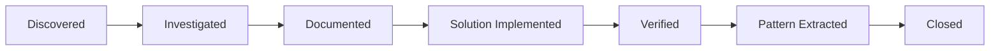

# ISSUES.md - Trinity Method SDK

**Trinity Method v2.1.0 - Issue Intelligence System**
**Technology Stack**: JavaScript/TypeScript
**Framework**: Node.js
**Last Updated**: 2026-01-22

---

## 🔴 ACTIVE ISSUES

### Critical (P0) - Immediate Action Required

````yaml
Issue_ID: {{PROJECT_PREFIX}}-C001
Title: {{CRITICAL_ISSUE_TITLE}}
Component: {{AFFECTED_COMPONENT}}
Impact: {{IMPACT_DESCRIPTION}}
Status: ACTIVE
First_Seen: {{DATE}}
Last_Seen: {{DATE}}
Occurrences: {{COUNT}}

Symptoms:
  - {{SYMPTOM_1}}
  - {{SYMPTOM_2}}

Root_Cause: {{ROOT_CAUSE}}

Investigation_Path:
  1. {{INVESTIGATION_STEP_1}}
  2. {{INVESTIGATION_STEP_2}}
  3. {{INVESTIGATION_STEP_3}}

Solution:
  ```JavaScript/TypeScript
  {{SOLUTION_CODE}}
````

Prevention:

- {{PREVENTION_1}}
- {{PREVENTION_2}}

````

### High Priority (P1) - Core Functionality

#### ✅ RESOLVED: Next.js Detection Priority Bug
```yaml
Issue_ID: TMS-001
Title: Next.js projects detected as React
Component: src/cli/utils/detect-stack.ts
Status: RESOLVED (2025-12-20)
Severity: HIGH

Root_Cause: React dependency checked before Next.js in framework detection

Solution:
  - Reordered framework detection to check Next.js before React (lines 127-130)
  - Next.js projects include React as dependency, so React check must come after

Prevention:
  - Always check more specific frameworks before generic ones
  - Add test coverage for framework detection priority
````

#### ✅ RESOLVED: Malformed JSON Crashes Detection

```yaml
Issue_ID: TMS-002
Title: Malformed package.json causes crash in detectStack
Component: src/cli/utils/detect-stack.ts
Status: RESOLVED (2025-12-20)
Severity: HIGH

Root_Cause: Language set before JSON parse, no error handling

Solution:
  - Wrapped JSON parsing in try-catch block (lines 118-154)
  - Only set language after successful JSON parse

Prevention:
  - Always validate external data before processing
  - Use try-catch for all JSON.parse operations
```

### Medium Priority (P2) - User Experience

#### ✅ RESOLVED: Flutter YAML Nested Dependencies Not Counted

```yaml
Issue_ID: TMS-003
Title: Flutter nested YAML dependencies not recognized
Component: src/cli/utils/codebase-metrics.ts
Status: RESOLVED (2025-12-20)
Severity: MEDIUM

Root_Cause: Regex only matched single-line YAML entries

Solution:
  - Updated regex to handle multi-line nested entries (lines 289-296)
  - Example: flutter:\n  sdk: flutter now correctly parsed

Prevention:
  - Test YAML parsing with nested structures
  - Use YAML parser library for complex parsing
```

#### ✅ RESOLVED: Rust Complex Dependencies Not Recognized

```yaml
Issue_ID: TMS-004
Title: Rust TOML dependencies with { syntax not detected
Component: src/cli/utils/codebase-metrics.ts
Status: RESOLVED (2025-12-20)
Severity: MEDIUM

Root_Cause: Regex only accepted = delimiter, not { syntax

Solution:
  - Updated regex to accept both = and { delimiters (lines 326-352)
  - Handle lines without trailing newlines

Prevention:
  - Test TOML parsing with multiple dependency formats
  - Consider using TOML parser library
```

#### ✅ RESOLVED: Package Manager Priority Incorrect

```yaml
Issue_ID: TMS-005
Title: npm detected instead of pnpm when both lockfiles present
Component: src/cli/utils/codebase-metrics.ts
Status: RESOLVED (2025-12-20)
Severity: MEDIUM

Root_Cause: npm checked before pnpm in detection order

Solution:
  - Reordered package manager checks: pnpm → yarn → npm (lines 440-457)
  - pnpm should have highest priority

Prevention:
  - Document package manager priority order
  - Add tests for multi-lockfile scenarios
```

### Low Priority (P3) - Enhancements

#### 🟡 KNOWN: Incomplete Metrics Placeholders in Technical-Debt.md

```yaml
Issue_ID: TMS-006
Title: Technical debt metrics show template placeholders instead of actual values
Component: trinity/knowledge-base/Technical-Debt.md
Status: ACTIVE
Severity: LOW (documentation quality issue)
First_Seen: 2026-01-22

Symptoms:
  - {{TODO_COUNT}}, {{FIXME_COUNT}}, {{HACK_COUNT}} not replaced with actual counts
  - {{FILES_500}}, {{AVG_LENGTH}} placeholders remain
  - {{DEPRECATED_COUNT}}, {{ANTIPATTERN_COUNT}}, {{PERF_ISSUE_COUNT}} placeholders remain

Root_Cause:
  - Metrics collection code exists (src/cli/utils/metrics/code-quality.ts:126-128)
  - Code runs patterns: /\/\/\s*TODO|#\s*TODO/gi for detection
  - But values not integrated into knowledge base updates

Solution_Options:
  1. Run metrics manually and update Technical-Debt.md
  2. Create automated script to populate placeholders
  3. Add metrics to /trinity-docs-update command

Prevention:
  - Include metrics collection in /trinity-end workflow
  - Add metrics validation to CI pipeline
  - Auto-populate during documentation updates
```

#### 🟡 KNOWN: JUNO Docs-Update Checklist Complexity

```yaml
Issue_ID: TMS-007
Title: JUNO docs-update checklist is 1,337 lines with high cognitive load
Component: trinity/templates/documentation/reports/juno-docs-update-checklist.md.template
Status: ACTIVE
Severity: LOW (usability concern)
First_Seen: 2026-01-22

Symptoms:
  - Extensive database verification protocol requirements
  - Multi-step production database connection verification
  - Requires advanced database knowledge (PostgreSQL, MySQL, SQLite, Docker)
  - Error handling paths not fully specified

Impact:
  - JUNO execution may be slower due to checklist length
  - Higher risk of missed steps
  - Steep learning curve for new users

Mitigation:
  - Checklist is comprehensive to ensure quality
  - Autonomous execution reduces human burden
  - Well-organized sections improve navigation

Future_Improvement:
  - Consider breaking into sub-checklists by database type
  - Add quick reference guide
  - Provide flowchart for decision trees
```

#### 🟡 KNOWN: APO Parallel Execution Coordination Edge Cases

```yaml
Issue_ID: TMS-008
Title: APO parallel execution lacks explicit timeout and restart handling
Component: trinity/templates/.claude/commands/maintenance/trinity-docs-update.md.template
Status: ACTIVE
Severity: LOW (edge case handling)
First_Seen: 2026-01-22

Symptoms:
  - No explicit timeout handling for parallel APO execution
  - Task distribution algorithm between APO-1, APO-2, APO-3 not fully documented
  - Edge case: When APO-2 has no work, Phase 2 Step 2.2 allows only APO-3 tasks
  - Restart mechanism for incomplete APOs could create infinite loops (not documented)

Impact:
  - In rare cases, APO might stall without clear recovery path
  - JUNO verification loop might miss some edge cases

Mitigation:
  - JUNO verification loop catches incomplete work
  - Autonomous execution allows APO retry
  - Well-tested in practice during v2.1.0 development

Future_Improvement:
  - Add explicit timeout parameters
  - Document task distribution algorithm
  - Add circuit breaker for verification loop
  - Specify max verification loop iterations
```

---

## 📊 Node.js-SPECIFIC PATTERNS

### Common Node.js Issues

#### Pattern: {{FRAMEWORK_PATTERN_1}}

**Frequency**: HIGH
**Impact**: Performance/Functionality/Security
**Category**: {{CATEGORY}}

**Problem Description**:
{{PROBLEM_DESCRIPTION}}

**Typical Symptoms**:

1. {{SYMPTOM_1}}
2. {{SYMPTOM_2}}
3. {{SYMPTOM_3}}

**Investigation Approach**:

```bash
# Node.js specific investigation
{{INVESTIGATION_COMMANDS}}
```

**Known Solutions**:

```JavaScript/TypeScript
// Node.js specific solution
{{SOLUTION_PATTERN}}
```

**Prevention Measures**:

- {{PREVENTION_MEASURE_1}}
- {{PREVENTION_MEASURE_2}}
- {{PREVENTION_MEASURE_3}}

**Related Issues**: [{{RELATED_ISSUE_IDS}}]

---

## 🌍 UNIVERSAL DEVELOPMENT PATTERNS

### State Management Issues

#### Pattern: State Synchronization Failure

**Frequency**: MEDIUM
**Impact**: Data Integrity
**Applicable To**: All frameworks with state management

**Problem**: State becomes out of sync between components
**Root Causes**:

1. Race conditions in async operations
2. Improper state mutation
3. Missing state update propagation

**Universal Solution Pattern**:

```JavaScript/TypeScript
// State synchronization pattern
{{STATE_SYNC_PATTERN}}
```

### Performance Optimization Patterns

#### Pattern: Render Performance Degradation

**Frequency**: HIGH
**Impact**: User Experience

**Detection**:

```javascript
// Performance monitoring
const performanceMonitor = {
  measureRender: (component) => {
    const startTime = performance.now();
    // Render logic
    const endTime = performance.now();
    if (endTime - startTime > THRESHOLD) {
      console.warn(`Slow render: ${component}`);
    }
  },
};
```

### Security Patterns

#### Pattern: Input Validation Bypass

**Frequency**: MEDIUM
**Impact**: CRITICAL

**Prevention Strategy**:

```JavaScript/TypeScript
// Input validation pattern
{{VALIDATION_PATTERN}}
```

---

## 🔬 TRINITY METHOD PATTERNS

### Investigation Protocol Issues

#### Pattern: Investigation Scope Creep

**Frequency**: HIGH
**Impact**: Development Velocity

**Problem**: Investigations expand beyond intended scope
**Solution**:

1. Set strict time boxes (30 min max)
2. Document tangential findings separately
3. Create follow-up investigations

### Knowledge Capture Issues

#### Pattern: Pattern Documentation Lag

**Frequency**: MEDIUM
**Impact**: Knowledge Reuse

**Problem**: Patterns discovered but not documented immediately
**Solution**:

- Document patterns within the same session
- Use pattern template immediately
- Link to investigation that discovered it

---

## 📈 ISSUE METRICS

### Pattern Recognition Statistics

```yaml
Total_Patterns_Identified: {{COUNT}}
Patterns_This_Month: {{COUNT}}
Most_Frequent_Pattern: {{PATTERN_NAME}}
Success_Rate: {{PERCENTAGE}}%

By_Category:
  Performance: {{COUNT}}
  Security: {{COUNT}}
  State_Management: {{COUNT}}
  Integration: {{COUNT}}
  UI_UX: {{COUNT}}
```

### Issue Resolution Metrics

```yaml
Average_Resolution_Time:
  P0_Critical: {{TIME}}
  P1_High: {{TIME}}
  P2_Medium: {{TIME}}
  P3_Low: {{TIME}}

First_Time_Fix_Rate: {{PERCENTAGE}}%
Regression_Rate: {{PERCENTAGE}}%
Pattern_Prevention_Rate: {{PERCENTAGE}}%
```

### Recurrence Tracking

| Issue Pattern | First Seen | Last Seen | Occurrences | Status     |
| ------------- | ---------- | --------- | ----------- | ---------- |
| {{PATTERN_1}} | {{DATE}}   | {{DATE}}  | {{COUNT}}   | {{STATUS}} |
| {{PATTERN_2}} | {{DATE}}   | {{DATE}}  | {{COUNT}}   | {{STATUS}} |

---

## 🛠️ INVESTIGATION QUEUE

### Pending Investigations

1. **{{INVESTIGATION_1}}**
   - Scope: {{SCOPE}}
   - Estimated Time: {{TIME}}
   - Dependencies: {{DEPENDENCIES}}

2. **{{INVESTIGATION_2}}**
   - Scope: {{SCOPE}}
   - Estimated Time: {{TIME}}
   - Dependencies: {{DEPENDENCIES}}

### Completed Investigations (This Session)

- [x] {{COMPLETED_1}} - See: trinity/investigations/{{DATE}}-{{INVESTIGATION}}.md
- [x] {{COMPLETED_2}} - See: trinity/investigations/{{DATE}}-{{INVESTIGATION}}.md

---

## 🔄 ISSUE LIFECYCLE

### Issue States



### State Definitions

1. **Discovered**: Issue identified but not investigated
2. **Investigated**: Root cause analysis complete
3. **Documented**: Full documentation in ISSUES.md
4. **Solution Implemented**: Fix applied to codebase
5. **Verified**: Fix confirmed working
6. **Pattern Extracted**: Reusable pattern documented
7. **Closed**: Issue resolved and knowledge captured

---

## 📝 ISSUE TEMPLATE

```yaml
Issue_ID: {{PROJECT_PREFIX}}-{{CATEGORY}}{{NUMBER}}
Title: {{DESCRIPTIVE_TITLE}}
Component: {{AFFECTED_COMPONENT}}
Framework_Specific: {{YES/NO}}
Impact: {{CRITICAL/HIGH/MEDIUM/LOW}}
Status: {{ACTIVE/INVESTIGATING/RESOLVED}}

Discovery:
  Date: {{DATE}}
  Discovered_By: {{METHOD/PERSON}}
  Session: {{SESSION_ID}}

Symptoms:
  - {{SYMPTOM_1}}
  - {{SYMPTOM_2}}

Root_Cause_Analysis:
  Investigation_Time: {{MINUTES}}
  Root_Cause: {{DESCRIPTION}}
  Contributing_Factors: [{{LIST}}]

Solution:
  Implementation_Time: {{MINUTES}}
  Code_Changes: {{FILES_CHANGED}}
  Tests_Added: {{TEST_COUNT}}

Prevention:
  Pattern_Created: {{YES/NO}}
  Pattern_Location: trinity/patterns/{{PATTERN_FILE}}
  Guidelines_Updated: {{YES/NO}}

Metrics:
  Recurrence_Risk: {{HIGH/MEDIUM/LOW}}
  Similar_Issues_Prevented: {{COUNT}}
```

---

## 🎯 PREVENTION STRATEGIES

### Proactive Measures by Category

#### Performance Issues

1. Implement performance monitoring from start
2. Set up automated performance testing
3. Regular performance audits

#### State Management Issues

1. Define clear state ownership
2. Implement state validation
3. Use immutable state patterns

#### Security Issues

1. Input validation on all boundaries
2. Regular security scanning
3. Security review checklist

#### Integration Issues

1. Contract testing between components
2. Mock external dependencies
3. Integration test suite

---

## 📊 WEEKLY ISSUE REVIEW

### Issues This Week

- **New Issues**: {{COUNT}}
- **Resolved Issues**: {{COUNT}}
- **Patterns Discovered**: {{COUNT}}
- **Investigations Completed**: {{COUNT}}

### Trending Patterns

1. {{TRENDING_PATTERN_1}} - {{OCCURRENCE_INCREASE}}%
2. {{TRENDING_PATTERN_2}} - {{OCCURRENCE_INCREASE}}%

### Action Items

- [ ] Investigate {{HIGH_PRIORITY_PATTERN}}
- [ ] Document {{UNDOCUMENTED_PATTERN}}
- [ ] Implement prevention for {{RECURRING_ISSUE}}

---

## 🔗 RELATED DOCUMENTS

- **Technical-Debt.md**: Detailed debt tracking
- **ARCHITECTURE.md**: System design and components
- **Trinity.md**: Methodology implementation
- **To-do.md**: Pending fixes and improvements
- **Pattern Library**: trinity/patterns/

---

## 📝 WHEN TO UPDATE THIS DOCUMENT

This is a **living issue intelligence system** that should be updated continuously to capture patterns and prevent recurring issues.

### Immediate Updates Required ⚠️

Update **as soon as discovered** (real-time):

- ✅ **New Issue Discovered**: Add to Active Issues with full details (symptoms, root cause, solution)
- ✅ **Issue Resolved**: Move from Active to documented pattern, mark resolution date
- ✅ **Pattern Recognized**: When same issue appears 2+ times, create pattern entry
- ✅ **Investigation Complete**: Link investigation file, add root cause analysis
- ✅ **New Framework Issue**: Add to Node.js-Specific Patterns section
- ✅ **Universal Pattern Found**: Add to Universal Development Patterns (applies to all frameworks)
- ✅ **Trinity Method Issue**: Document methodology issues in Trinity Method Patterns

### Session Updates (Via `/trinity-end`) 🔄

Update at end of each development session:

- Close resolved issues from current session
- Add new issues encountered during session
- Update issue metrics (resolution time, recurrence rate)
- Update pattern frequency counts
- Link to completed investigations
- Update weekly issue review section
- Refresh trending patterns analysis

### Weekly Reviews ⏰

Track issue trends and prevention effectiveness:

- Review issues added this week
- Calculate pattern prevention success rate
- Identify trending patterns (increasing occurrences)
- Update action items for high-priority patterns
- Assess investigation queue priorities

### Monthly Audits 📅

Deep pattern analysis and prevention strategy:

- Pattern effectiveness review (which patterns prevent most issues)
- Update prevention strategies based on learnings
- Consolidate similar patterns
- Archive resolved patterns that haven't recurred
- Measure issue recurrence rate

### Cross-Document Update Triggers 🔗

**When updating ISSUES.md, also check:**

- **[Technical-Debt.md](./Technical-Debt.md)**: Add technical debt items for issues that reveal debt
- **[To-do.md](./To-do.md)**: Create tasks to fix active issues or implement prevention
- **[ARCHITECTURE.md](./ARCHITECTURE.md)**: Update if issue reveals architectural problem
- **[Trinity.md](./Trinity.md)**: Update investigation protocols if new investigation approach discovered
- **[CODING-PRINCIPLES.md](./CODING-PRINCIPLES.md)**: Add principle if issue reveals coding standard gap
- **[TESTING-PRINCIPLES.md](./TESTING-PRINCIPLES.md)**: Add test requirement if issue was missed by tests

### Update Scenarios - What to Change

**Scenario: Bug Found During Development**

```yaml
Updates_Required:
  - Active_Issues: Add new issue with P0/P1/P2/P3 priority
  - Issue_Template: Fill with symptoms, root cause, solution
  - Pattern_Check: Is this a recurring issue? Create pattern if yes
  - Investigation_Link: Link to trinity/investigations/ file if investigation done
  - Cross_References:
      - To-do.md: Add fix task with priority
      - Technical-Debt.md: Add debt if issue reveals shortcuts
```

**Scenario: Issue Resolved**

```yaml
Updates_Required:
  - Active_Issues: Remove from active section
  - Pattern_Extraction: If issue can recur, create pattern template
  - Issue_Metrics: Update resolution metrics
  - Prevention_Strategy: Add prevention measures to relevant section
  - Cross_References:
      - To-do.md: Mark related task complete
      - Technical-Debt.md: Mark related debt resolved
```

**Scenario: Pattern Recognized (3+ occurrences)**

```yaml
Updates_Required:
  - Pattern_Section: Create new pattern entry or update existing
  - Pattern_Frequency: Update occurrence count
  - Related_Issues: Link all issue IDs that match this pattern
  - Prevention_Measures: Document how to prevent this pattern
  - Pattern_Library: Create pattern file in trinity/patterns/
  - Cross_References:
      - Technical-Debt.md: Link pattern to debt if applicable
      - CODING-PRINCIPLES.md: Add principle if pattern reveals standard gap
```

**Scenario: Investigation Completed**

```yaml
Updates_Required:
  - Issue_Entry: Add investigation findings to root cause section
  - Investigation_Queue: Remove from pending, add to completed
  - Pattern_Discovery: Create pattern if investigation revealed one
  - Resolution_Path: Document solution from investigation
  - Cross_References:
      - Trinity.md: Link investigation file
      - Pattern_Library: Create pattern file if reusable solution found
```

**Scenario: Framework-Specific Issue Found**

```yaml
Updates_Required:
  - Framework_Specific_Patterns: Add issue to Node.js section
  - Frequency_Tracking: Mark as HIGH/MEDIUM/LOW based on likelihood
  - Known_Solutions: Add framework-specific solution code
  - Prevention_Measures: Add framework best practices to prevent
  - Cross_References:
      - AI-DEVELOPMENT-GUIDE.md: Update if framework workflow needs adjustment
```

### How to Update

**Step-by-step process:**

1. **Categorize Issue**: Is it Critical/High/Medium/Low priority? Framework-specific or universal?
2. **Document Completely**: Fill issue template with all details (don't leave partial entries)
3. **Check for Patterns**: Search document for similar issues (2+ = pattern)
4. **Link Investigation**: If investigation file exists, link it
5. **Update Metrics**: Increment counts, update averages
6. **Cross-Reference**: Update related documents (To-do, Technical-Debt, etc.)
7. **Pattern Library**: Create trinity/patterns/ file if reusable solution
8. **Update Timestamp**: Set `Last Updated: 2025-12-20` to actual date

**Quality Checklist:**

- [ ] Issue has complete symptoms, root cause, and solution
- [ ] Priority matches impact (P0 = production down, P1 = core feature broken, etc.)
- [ ] Pattern frequency accurate (count all occurrences)
- [ ] Links to investigation files valid
- [ ] Cross-references to other docs updated
- [ ] Prevention measures actionable

### When NOT to Update ❌

**Don't add to ISSUES.md if:**

- Simple typo fixes (not a pattern)
- Expected behavior misunderstood (user error, not issue)
- Third-party library bugs (document in ARCHITECTURE dependencies instead)
- One-time environment issues (not reproducible)
- Feature requests (add to To-do.md instead)

**When to merge issues:**

- If two issues have same root cause, merge into single pattern
- Update pattern frequency count to reflect all occurrences

### Issue vs. Debt vs. Todo 🤔

**Add to ISSUES.md when:**

- Bug that can recur
- Pattern that should be prevented
- Framework-specific problem to watch for

**Add to Technical-Debt.md when:**

- Code quality problem (TODOs, complexity, coverage)
- Known shortcut that needs refactoring
- Accumulating technical burden

**Add to To-do.md when:**

- Task to complete
- Feature to implement
- One-time action item

**Many items belong in multiple documents** (issue + debt + todo for fix).

---

**Document Status**: Living Issue Intelligence System
**Update Frequency**: Real-time (as issues discovered) + session-based
**Maintained By**: Development team using Trinity Method
**Referenced By**: `/trinity-end` command for session updates
**Pattern Library**: Creates trinity/patterns/ files
**Last Updated**: 2025-12-20

---

_Issue tracking powered by Trinity Method v2.0_
_Continuous pattern recognition and prevention system_
