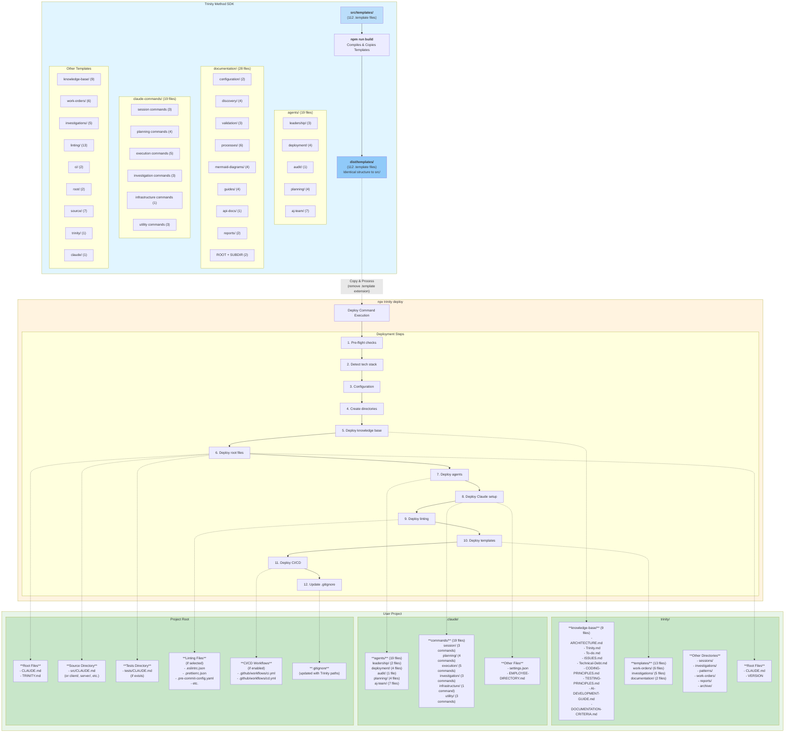

# Trinity SDK Deployment Architecture

## Overview

This document maps out the complete Trinity Method SDK deployment architecture, showing:

1. **Source Templates** in the SDK (`src/templates/`)
2. **Build Output** in the SDK (`dist/templates/`)
3. **Deployment Targets** in user projects

**Total Templates:** 112 template files across 11 categories

---

## Deployment Flow Diagram



---

## Template Categories Breakdown

### 1. Agents (19 templates)

**Source:** `src/templates/agents/`
**Deployed to:** `.claude/agents/`
**Extension:** `.md.template` → `.md`

| Category        | Count  | Templates                                                                                                                                                                                   |
| --------------- | ------ | ------------------------------------------------------------------------------------------------------------------------------------------------------------------------------------------- |
| **leadership/** | 2      | aly-cto.md, aj-maestro.md                                                                                                                                                                   |
| **deployment/** | 4      | tan-structure.md, zen-knowledge.md, ino-context.md, ein-cicd.md                                                                                                                             |
| **audit/**      | 1      | juno-auditor.md                                                                                                                                                                             |
| **planning/**   | 4      | mon-requirements.md, ror-design.md, tra-planner.md, eus-decomposer.md                                                                                                                       |
| **aj-team/**    | 7      | kil-task-executor.md, bas-quality-gate.md, dra-code-reviewer.md, apo-documentation-specialist.md, bon-dependency-manager.md, cap-configuration-specialist.md, uro-refactoring-specialist.md |
| **TOTAL**       | **18** | **(Note: aj-cc.md exists but not deployed by deploy command)**                                                                                                                              |

---

### 2. Claude Commands (19 templates)

**Source:** `src/templates/shared/claude-commands/`
**Deployed to:** `.claude/commands/{category}/`
**Extension:** `.md.template` → `.md`

| Category            | Count  | Commands                                                                                           |
| ------------------- | ------ | -------------------------------------------------------------------------------------------------- |
| **session/**        | 3      | trinity-start.md, trinity-continue.md, trinity-end.md                                              |
| **planning/**       | 4      | trinity-requirements.md, trinity-design.md, trinity-decompose.md, trinity-plan.md                  |
| **execution/**      | 5      | trinity-orchestrate.md, trinity-audit.md, trinity-readme.md, trinity-docs.md, trinity-changelog.md |
| **investigation/**  | 3      | trinity-create-investigation.md, trinity-plan-investigation.md, trinity-investigate-templates.md   |
| **infrastructure/** | 1      | trinity-init.md                                                                                    |
| **utility/**        | 3      | trinity-agents.md, trinity-verify.md, trinity-workorder.md                                         |
| **TOTAL**           | **19** | **All categorized slash commands**                                                                 |

---

### 3. Documentation Templates (28 templates)

**Source:** `src/templates/documentation/`
**Deployed to:** `trinity/templates/documentation/` (only 2 root templates)
**Note:** Most documentation templates are for use by `/execution:trinity-docs` command

| Subdirectory          | Count  | Purpose                                                                                                                                           |
| --------------------- | ------ | ------------------------------------------------------------------------------------------------------------------------------------------------- |
| **configuration/**    | 2      | documentation-structure.md, env-example-generator.md                                                                                              |
| **discovery/**        | 4      | framework-detection.md, component-discovery.md, api-endpoint-scanner.md, env-variable-extraction.md                                               |
| **validation/**       | 3      | juno-quality-gates.md, documentation-verification-rules.md, apo-self-validation.md                                                                |
| **processes/**        | 6      | apo-workflow-common.md, apo-diagram-specific.md, apo-guide-specific.md, apo-config-specific.md, error-handling-protocol.md, fallback-mechanism.md |
| **mermaid-diagrams/** | 4      | mvc-flow.md, database-er.md, api-endpoint-map.md, component-hierarchy.md                                                                          |
| **guides/**           | 4      | getting-started.md, api-development.md, deployment.md, contributing.md                                                                            |
| **api-docs/**         | 1      | README.md                                                                                                                                         |
| **reports/**          | 2      | juno-final-report.md, juno-internal-report.md                                                                                                     |
| **Root docs/**        | 2      | ROOT-README.md, SUBDIRECTORY-README.md _(deployed to trinity/templates/documentation/)_                                                           |
| **TOTAL**             | **28** | **Used by trinity-docs command**                                                                                                                  |

---

### 4. Knowledge Base (9 templates)

**Source:** `src/templates/knowledge-base/`
**Deployed to:** `trinity/knowledge-base/`
**Extension:** `.md.template` → `.md`

| File                      | Purpose                            |
| ------------------------- | ---------------------------------- |
| ARCHITECTURE.md           | Project architecture documentation |
| Trinity.md                | Trinity Method methodology guide   |
| To-do.md                  | Task tracking                      |
| ISSUES.md                 | Known issues database              |
| Technical-Debt.md         | Technical debt tracking            |
| CODING-PRINCIPLES.md      | Coding standards                   |
| TESTING-PRINCIPLES.md     | Testing standards                  |
| AI-DEVELOPMENT-GUIDE.md   | AI-assisted development guide      |
| DOCUMENTATION-CRITERIA.md | Documentation quality criteria     |

---

### 5. Work Order Templates (6 templates)

**Source:** `src/templates/work-orders/`
**Deployed to:** `trinity/templates/work-orders/`
**Extension:** `.md.template` → `.md`

| Template                   | Purpose                            |
| -------------------------- | ---------------------------------- |
| INVESTIGATION-TEMPLATE.md  | Bug investigation work orders      |
| IMPLEMENTATION-TEMPLATE.md | Feature implementation work orders |
| ANALYSIS-TEMPLATE.md       | Codebase analysis work orders      |
| AUDIT-TEMPLATE.md          | Quality audit work orders          |
| PATTERN-TEMPLATE.md        | Design pattern work orders         |
| VERIFICATION-TEMPLATE.md   | Verification work orders           |

---

### 6. Investigation Templates (5 templates)

**Source:** `src/templates/investigations/`
**Deployed to:** `trinity/templates/investigations/`
**Extension:** `.md.template` → `.md`

| Template       | Purpose                            |
| -------------- | ---------------------------------- |
| bug.md         | Bug investigation template         |
| feature.md     | Feature investigation template     |
| performance.md | Performance investigation template |
| security.md    | Security investigation template    |
| technical.md   | Technical investigation template   |

---

### 7. Linting Configuration (13 templates)

**Source:** `src/templates/linting/{framework}/`
**Deployed to:** Project root (conditional)
**Extension:** `.template` → **(no extension)**

| Framework    | Count  | Files                                                                                                             |
| ------------ | ------ | ----------------------------------------------------------------------------------------------------------------- |
| **nodejs/**  | 5      | .eslintrc-commonjs.json, .eslintrc-esm.json, .eslintrc-typescript.json, .prettierrc.json, .pre-commit-config.yaml |
| **python/**  | 3      | .flake8, pyproject.toml, .pre-commit-config.yaml                                                                  |
| **flutter/** | 2      | analysis_options.yaml, .pre-commit-config.yaml                                                                    |
| **rust/**    | 3      | clippy.toml, rustfmt.toml, .pre-commit-config.yaml                                                                |
| **TOTAL**    | **13** | **Framework-specific linting**                                                                                    |

---

### 8. CI/CD Templates (2 templates)

**Source:** `src/templates/ci/`
**Deployed to:** `.github/workflows/` (conditional)
**Extension:** `.yml.template` → `.yml`

| File   | Purpose                         |
| ------ | ------------------------------- |
| ci.yml | Continuous Integration workflow |
| cd.yml | Continuous Deployment workflow  |

---

### 9. Root Files (2 templates)

**Source:** `src/templates/root/`
**Deployed to:** Project root
**Extension:** `.md.template` → `.md`

| File       | Purpose                                   |
| ---------- | ----------------------------------------- |
| CLAUDE.md  | Root context file (hierarchy entry point) |
| TRINITY.md | Trinity Method quick reference            |

---

### 10. Source CLAUDE.md Files (7 templates)

**Source:** `src/templates/source/`
**Deployed to:** `{sourceDir}/CLAUDE.md`, `tests/CLAUDE.md`
**Extension:** `.md.template` → `.md`

| Template          | Deployed When                              |
| ----------------- | ------------------------------------------ |
| nodejs-CLAUDE.md  | Node.js projects (src/, lib/, etc.)        |
| react-CLAUDE.md   | React/Next.js projects (src/, components/) |
| python-CLAUDE.md  | Python projects (src/, app/)               |
| flutter-CLAUDE.md | Flutter projects (lib/)                    |
| rust-CLAUDE.md    | Rust projects (src/)                       |
| base-CLAUDE.md    | Unknown/fallback projects                  |
| tests-CLAUDE.md   | All projects (if tests/ directory exists)  |

---

### 11. Trinity CLAUDE.md (1 template)

**Source:** `src/templates/trinity/CLAUDE.md.template`
**Deployed to:** `trinity/CLAUDE.md`
**Purpose:** Trinity Method context file

---

### 12. Employee Directory (1 template)

**Source:** `src/templates/claude/EMPLOYEE-DIRECTORY.md.template`
**Deployed to:** `.claude/EMPLOYEE-DIRECTORY.md`
**Purpose:** Complete agent directory and workflow guide

---

## Deployment Summary

### Files Created in User Project

| Location                            | Files      | Description                                                |
| ----------------------------------- | ---------- | ---------------------------------------------------------- |
| `trinity/knowledge-base/`           | 9          | Knowledge base documentation                               |
| `trinity/templates/work-orders/`    | 6          | Work order templates                                       |
| `trinity/templates/investigations/` | 5          | Investigation templates                                    |
| `trinity/templates/documentation/`  | 2          | Documentation templates (ROOT-README, SUBDIRECTORY-README) |
| `trinity/`                          | 2          | CLAUDE.md, VERSION                                         |
| `.claude/agents/`                   | 18         | Agent configurations                                       |
| `.claude/commands/`                 | 19         | Slash commands (6 categories)                              |
| `.claude/`                          | 2          | settings.json, EMPLOYEE-DIRECTORY.md                       |
| **Project root**                    | 2+         | CLAUDE.md, TRINITY.md, (+linting if selected)              |
| **Source directories**              | 1-3        | src/CLAUDE.md, tests/CLAUDE.md (if exists)                 |
| **.github/workflows/**              | 0-2        | CI/CD workflows (if enabled)                               |
| **TOTAL**                           | **66-80+** | **Depending on configuration**                             |

---

## Template Processing

### Variable Substitution

All templates support variable substitution during deployment:

```markdown
{{PROJECT_NAME}} → User's project name
{{FRAMEWORK}} → Detected framework (Node.js, React, etc.)
{{LANGUAGE}} → Programming language (TypeScript, Python, etc.)
{{SOURCE_DIR}} → Source directory (src, lib, app, etc.)
{{PACKAGE_MANAGER}} → Package manager (npm, yarn, pnpm)
{{BACKEND_FRAMEWORK}} → Backend framework (Express, NestJS, etc.)
{{CURRENT_DATE}} → Deployment timestamp
{{TRINITY_VERSION}} → SDK version (e.g., 2.0.9)
{{TEST_FRAMEWORK}} → Test framework (Jest, Vitest, etc.)
{{TODO_COUNT}} → Number of TODOs in codebase
{{FILE_COUNT}} → Total files in project
{{DEPENDENCY_COUNT}} → Number of dependencies
```

### Extension Handling

| Source Extension     | Deployed Extension | Notes               |
| -------------------- | ------------------ | ------------------- |
| `.md.template`       | `.md`              | Markdown templates  |
| `.json.template`     | `.json`            | Configuration files |
| `.yaml.template`     | `.yaml`            | YAML configs        |
| `.yml.template`      | `.yml`             | GitHub Actions      |
| `.toml.template`     | `.toml`            | Rust configs        |
| `.template` (no ext) | **(no extension)** | Linting dot files   |

---

## Directory Structure Created

```
user-project/
├── CLAUDE.md                           # Root context
├── TRINITY.md                          # Trinity quick reference
├── .gitignore                          # Updated with Trinity paths
├── [linting files]                     # Conditional (ESLint, Prettier, etc.)
│
├── trinity/
│   ├── CLAUDE.md                       # Trinity Method context
│   ├── VERSION                         # SDK version
│   ├── knowledge-base/                 # 9 knowledge base files
│   ├── templates/                      # 13 template files
│   │   ├── work-orders/                # 6 work order templates
│   │   ├── investigations/             # 5 investigation templates
│   │   └── documentation/              # 2 README templates
│   ├── sessions/                       # (empty, for user sessions)
│   ├── investigations/                 # (empty, for user investigations)
│   ├── work-orders/                    # (empty, for user work orders)
│   ├── patterns/                       # (empty, for design patterns)
│   ├── reports/                        # (empty, for audit reports)
│   └── archive/                        # (empty, for archived work)
│
├── .claude/
│   ├── settings.json                   # Empty Claude Code settings
│   ├── EMPLOYEE-DIRECTORY.md           # Agent directory
│   ├── agents/                         # 18 agent configurations
│   │   ├── leadership/                 # 2 agents (ALY, AJ MAESTRO)
│   │   ├── deployment/                 # 4 agents (TAN, ZEN, INO, EIN)
│   │   ├── audit/                      # 1 agent (JUNO)
│   │   ├── planning/                   # 4 agents (MON, ROR, TRA, EUS)
│   │   └── aj-team/                    # 7 agents (KIL, BAS, DRA, APO, BON, CAP, URO)
│   └── commands/                       # 19 slash commands
│       ├── session/                    # 3 commands (start, continue, end)
│       ├── planning/                   # 4 commands (requirements, design, decompose, plan)
│       ├── execution/                  # 5 commands (orchestrate, audit, readme, docs, changelog)
│       ├── investigation/              # 3 commands (create, plan, templates)
│       ├── infrastructure/             # 1 command (init)
│       └── utility/                    # 3 commands (agents, verify, workorder)
│
├── src/                                # (or lib/, app/, etc.)
│   └── CLAUDE.md                       # Framework-specific context
│
├── tests/                              # (if exists)
│   └── CLAUDE.md                       # Testing context
│
└── .github/workflows/                  # (if CI/CD enabled)
    ├── ci.yml                          # Continuous Integration
    └── cd.yml                          # Continuous Deployment
```

---

## Special Notes

### Documentation Templates NOT Deployed to User Projects

The 28 documentation templates in `src/templates/documentation/` are **included in the build** (`dist/templates/documentation/`) but are **NOT deployed to user projects** by the `deploy` command.

**Why?** These templates are used dynamically by the `/execution:trinity-docs` command, which:

1. Reads templates directly from `trinity/templates/documentation/` (if user runs `npx trinity update` to deploy them manually)
2. OR accesses them from the SDK's `dist/templates/documentation/` directory

**Deployment Methods:**

- **Method 1:** Manual deployment via `npx trinity update --force` (copies all 28 templates to project)
- **Method 2:** Accessed directly by trinity-docs command from SDK installation

---

## Key Insights

1. **112 total templates** in SDK source
2. **66-80 files deployed** to user projects (depending on config)
3. **28 documentation templates** exist but are NOT deployed by default (used by trinity-docs command)
4. **19 agents** configured in `.claude/agents/`
5. **19 slash commands** deployed in `.claude/commands/`
6. **9 knowledge base files** in `trinity/knowledge-base/`
7. **13 template files** in `trinity/templates/` (work orders + investigations + docs)
8. **Framework-specific linting** (13 templates, conditionally deployed)
9. **CI/CD workflows** (2 templates, conditionally deployed)
10. **CLAUDE.md hierarchy** (4-5 files: root, trinity, src, tests)

---

**Generated:** 2026-01-15
**Trinity SDK Version:** 2.0.9
**Work Order:** WO-005 (Template Optimization)
