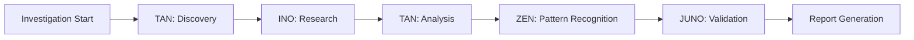

# Trinity AI Agents

Trinity Method SDK uses specialized AI agents to conduct investigations efficiently and effectively. Each agent has unique capabilities optimized for specific tasks.

## Agent Overview

<div className="grid md:grid-cols-2 gap-6 my-8">
  <AgentCard
    name="TAN"
    fullName="Technical Analysis Navigator"
    role="Deep Technical Analysis"
    description="Analyzes code structure, identifies patterns, and performs technical investigations"
    href="/agents/tan"
    color="blue"
  />
  <AgentCard
    name="ZEN"
    fullName="Pattern Recognition Expert"
    role="Architecture & Patterns"
    description="Identifies architectural patterns, best practices, and systemic issues"
    href="/agents/zen"
    color="green"
  />
  <AgentCard
    name="INO"
    fullName="Investigation & Research"
    role="Context & Research"
    description="Gathers external context, documentation, and industry best practices"
    href="/agents/ino"
    color="purple"
  />
  <AgentCard
    name="JUNO"
    fullName="Quality Assurance Officer"
    role="Quality Validation"
    description="Validates findings, ensures accuracy, and performs quality audits"
    href="/agents/juno"
    color="red"
  />
</div>

## How Agents Work Together

Agents collaborate in investigations following the Trinity Method workflow:



### Example: Security Audit

1. **TAN** scans codebase for authentication logic
2. **INO** fetches OWASP security guidelines
3. **TAN** analyzes auth implementation details
4. **ZEN** identifies security anti-patterns
5. **JUNO** validates findings and severity
6. **Report** generated with all findings

## Agent Capabilities Comparison

| Capability | TAN | ZEN | INO | JUNO |
|------------|-----|-----|-----|------|
| Code Analysis | ⭐⭐⭐ | ⭐⭐ | ⭐ | ⭐⭐ |
| Pattern Recognition | ⭐⭐ | ⭐⭐⭐ | ⭐ | ⭐⭐ |
| Research | ⭐ | ⭐ | ⭐⭐⭐ | ⭐ |
| Quality Validation | ⭐⭐ | ⭐⭐ | ⭐ | ⭐⭐⭐ |
| Documentation | ⭐⭐ | ⭐⭐⭐ | ⭐⭐ | ⭐⭐ |
| Performance Analysis | ⭐⭐⭐ | ⭐⭐ | ⭐ | ⭐⭐ |

## Agent Selection

Trinity automatically selects agents based on investigation type:

### Security Audit
- **Primary**: TAN (code analysis) + JUNO (validation)
- **Supporting**: INO (security standards)

### Performance Review
- **Primary**: TAN (profiling) + specialized AJ agent
- **Supporting**: ZEN (anti-patterns)

### Architecture Analysis
- **Primary**: ZEN (patterns) + TAN (structure)
- **Supporting**: INO (architecture docs)

### Code Quality
- **Primary**: JUNO (quality checks) + ZEN (patterns)
- **Supporting**: TAN (complexity analysis)

## Manual Agent Control

Override automatic selection:

```bash
# Use specific agents
trinity run INV-001 --agents TAN,JUNO

# Exclude agents
trinity run INV-001 --exclude-agents INO

# Single agent mode
trinity run INV-001 --agent TAN --solo
```

## Agent Configuration

Configure agent behavior:

```yaml
# trinity/config/agents.yml
agents:
  TAN:
    analysis-depth: deep        # shallow | medium | deep
    max-tokens: 50000
    parallel-analysis: true

  ZEN:
    pattern-detection: sensitive  # relaxed | normal | sensitive
    min-pattern-confidence: 0.8

  INO:
    research-sources: [official-docs, github, stackoverflow]
    max-research-time: 300s

  JUNO:
    validation-strictness: high  # low | medium | high
    false-positive-threshold: 0.1
```

## Agent Performance

Track agent performance:

```bash
trinity metrics agents
```

Output:

```
Agent Performance Metrics
━━━━━━━━━━━━━━━━━━━━━━━━━━━━━━━━━━━━━━━━
Agent  Tasks  Avg Time  Tokens   Accuracy
━━━━━━━━━━━━━━━━━━━━━━━━━━━━━━━━━━━━━━━━
TAN    142    4.2 min   8,500    94%
ZEN    89     6.1 min   12,300   92%
INO    56     3.8 min   6,200    96%
JUNO   134    5.3 min   9,800    98%
```

## Best Practices

### 1. Use Multiple Agents

Leverage agent collaboration:

```bash
# Better: Multiple perspectives
trinity run INV-001 --agents TAN,ZEN,JUNO

# Not recommended: Single agent
trinity run INV-001 --agent TAN --solo
```

### 2. Configure for Your Needs

Adjust agent behavior:

```yaml
# For quick investigations
agents:
  TAN:
    analysis-depth: shallow

# For thorough audits
agents:
  TAN:
    analysis-depth: deep
  JUNO:
    validation-strictness: high
```

### 3. Monitor Performance

Track agent efficiency:

```bash
trinity dashboard agents --investigation INV-001
```

## Troubleshooting

### Agent Timeouts

Increase timeout limits:

```yaml
agents:
  TAN:
    timeout: 600s  # 10 minutes
```

### Low Accuracy

Adjust agent parameters:

```yaml
agents:
  JUNO:
    validation-strictness: high
    false-positive-threshold: 0.05
```

### High Token Usage

Optimize agent configuration:

```yaml
agents:
  TAN:
    analysis-depth: medium  # instead of deep
    max-tokens: 30000      # reduce limit
```

## Next Steps

Explore individual agents:

- [TAN - Technical Analysis](/agents/tan)
- [ZEN - Pattern Recognition](/agents/zen)
- [INO - Research](/agents/ino)
- [JUNO - Quality Audit](/agents/juno)

Or learn about:

- [Investigation Wizard](/api/wizard) - Automated investigation setup
- [Analytics](/api/analytics) - Agent performance metrics
- [Best Practices](/trinity-method/best-practices) - Agent usage patterns

export function AgentCard({ name, fullName, role, description, href, color }) {
  const colorClasses = {
    blue: 'border-blue-500 dark:border-blue-400',
    green: 'border-green-500 dark:border-green-400',
    purple: 'border-purple-500 dark:border-purple-400',
    red: 'border-red-500 dark:border-red-400',
  };

  return (
    <a
      href={href}
      className={`block p-6 border-l-4 ${colorClasses[color]} bg-gray-50 dark:bg-gray-800 rounded-lg hover:shadow-lg transition`}
    >
      <div className="flex items-center gap-3 mb-3">
        <div className="text-2xl font-bold text-gray-900 dark:text-white">
          {name}
        </div>
        <div className="text-sm text-gray-500 dark:text-gray-400">
          {role}
        </div>
      </div>
      <div className="text-sm font-medium text-gray-700 dark:text-gray-300 mb-2">
        {fullName}
      </div>
      <p className="text-sm text-gray-600 dark:text-gray-400">
        {description}
      </p>
    </a>
  );
}
