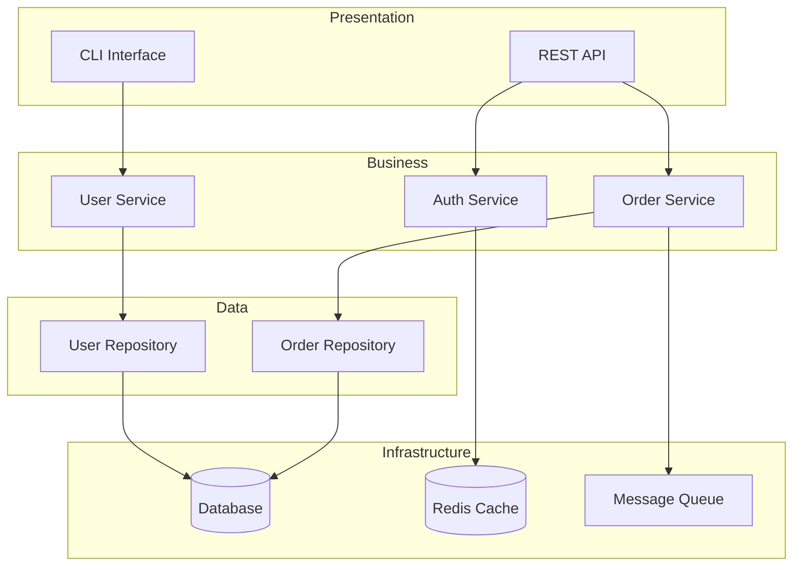

# Architecture Analysis Investigation

Comprehensive system architecture documentation and design pattern analysis using Trinity Method SDK.

## Overview

Architecture analysis investigations document system design, identify architectural patterns, assess technical debt, and provide recommendations for scalability and maintainability.

**Primary Agents**: ZEN (Pattern Recognition) + TAN (Structure Analysis)
**Supporting Agents**: INO (Architecture Research)
**Duration**: 4-6 hours (medium codebase)
**Output**: Architecture documentation, pattern catalog, improvement roadmap

## What Gets Analyzed

### 1. System Architecture
- Component structure and boundaries
- Layer separation (presentation, business, data)
- Module dependencies and coupling
- Service architecture (monolith, microservices, hybrid)

### 2. Design Patterns
- Creational patterns (Factory, Singleton, Builder)
- Structural patterns (Adapter, Decorator, Facade)
- Behavioral patterns (Observer, Strategy, Command)
- Anti-patterns and code smells

### 3. Data Architecture
- Database schema and relationships
- Data flow and transformations
- Caching strategies
- State management

### 4. Integration Architecture
- External API integrations
- Third-party dependencies
- Event systems and messaging
- Authentication and authorization

### 5. Technical Debt
- Circular dependencies
- God objects and classes
- Tight coupling areas
- Deprecated patterns

## Investigation Setup

### Quick Start

```bash
# Create architecture investigation
trinity wizard

# Follow prompts
? Investigation Type: Architecture Analysis
? Scope: Entire codebase
? Focus Areas: [x] System Structure
               [x] Design Patterns
               [x] Data Architecture
               [x] Technical Debt
? Documentation Level: Comprehensive
```

### Advanced Configuration

```bash
# Custom architecture investigation
trinity create investigation \
  --type architecture \
  --scope "src/**/*.ts" \
  --exclude "tests/**,build/**" \
  --depth deep \
  --agents ZEN,TAN,INO \
  --output-format "mermaid,markdown"
```

### Investigation Plan

Generated plan structure:

```yaml
investigation:
  type: architecture-analysis
  phases:
    - name: Discovery
      agents: [TAN, INO]
      tasks:
        - Scan codebase structure
        - Identify entry points
        - Map dependencies
        - Research architecture patterns

    - name: Analysis
      agents: [ZEN, TAN]
      tasks:
        - Identify architectural patterns
        - Analyze component boundaries
        - Assess coupling and cohesion
        - Document data flows

    - name: Documentation
      agents: [ZEN, INO]
      tasks:
        - Generate architecture diagrams
        - Create pattern catalog
        - Document design decisions
        - Recommend improvements
```

## Execution Flow

### Phase 1: Discovery (TAN + INO)

**TAN** scans codebase structure:
```bash
trinity run INV-001 --phase discovery
```

Output:
```
🔍 Discovering Architecture (TAN)
━━━━━━━━━━━━━━━━━━━━━━━━━━━━━━━━━━━━━━━━
✓ Entry points identified: 3
  - src/server.ts (Express server)
  - src/cli.ts (CLI entry)
  - src/index.ts (Public API)

✓ Modules discovered: 47
  - Core modules: 12
  - Feature modules: 23
  - Shared utilities: 12

✓ Dependencies mapped: 156 internal, 34 external
```

**INO** researches architecture patterns:
```
📚 Researching Patterns (INO)
━━━━━━━━━━━━━━━━━━━━━━━━━━━━━━━━━━━━━━━━
✓ Hexagonal Architecture (Ports & Adapters)
✓ Repository Pattern (Data Access)
✓ Service Layer Pattern
✓ Dependency Injection
✓ Event-Driven Architecture
```

### Phase 2: Pattern Analysis (ZEN + TAN)

**ZEN** identifies patterns:
```bash
trinity run INV-001 --phase analysis
```

Output:
```
🧩 Analyzing Patterns (ZEN)
━━━━━━━━━━━━━━━━━━━━━━━━━━━━━━━━━━━━━━━━
✓ Repository Pattern (8 implementations)
  - UserRepository, ProductRepository, OrderRepository...
  - Consistent interface: IRepository<T>
  - Database abstraction: ✓

✓ Dependency Injection (23 services)
  - Constructor injection: 21 ✓
  - Property injection: 2 ⚠️
  - DI Container: tsyringe

✓ Event-Driven (14 event handlers)
  - EventEmitter pattern
  - Domain events: UserCreated, OrderPlaced...

⚠️ Anti-Patterns Detected:
  - God Object: AppController (1,247 lines)
  - Circular Dependency: AuthService ↔ UserService
  - Tight Coupling: PaymentService → StripeAPI
```

**TAN** analyzes structure:
```
🏗️ Analyzing Structure (TAN)
━━━━━━━━━━━━━━━━━━━━━━━━━━━━━━━━━━━━━━━━
✓ Layer Separation: Good
  - Presentation (Controllers): 12 files
  - Business Logic (Services): 23 files
  - Data Access (Repositories): 8 files
  - Infrastructure: 14 files

✓ Module Boundaries: Moderate
  - Clear boundaries: 8 modules
  - Shared dependencies: 4 modules ⚠️
  - Cross-cutting concerns: Logging, Auth

⚠️ Coupling Analysis:
  - Afferent coupling (Ca): 3.2 avg
  - Efferent coupling (Ce): 4.1 avg
  - Instability (I): 0.56
```

### Phase 3: Documentation (ZEN + INO)

**ZEN** generates architecture diagrams:
```bash
trinity run INV-001 --phase documentation
```

Output generates Mermaid diagrams:



## Example Investigation

### Finding #1: Circular Dependency

**Severity**: 🟡 MEDIUM
**Location**: src/services/
**Pattern**: Anti-Pattern - Circular Dependency

#### Problem

```typescript
// ❌ Circular Dependency
// src/services/AuthService.ts
import { UserService } from './UserService';

export class AuthService {
  constructor(private userService: UserService) {}

  async login(email: string) {
    const user = await this.userService.findByEmail(email);
    // ...
  }
}

// src/services/UserService.ts
import { AuthService } from './AuthService';

export class UserService {
  constructor(private authService: AuthService) {}

  async createUser(data: UserData) {
    await this.authService.validatePermissions();
    // ...
  }
}
```

#### Solution

```typescript
// ✅ Break circular dependency with events or shared interface
// src/services/AuthService.ts
import { IPermissionValidator } from '../interfaces/IPermissionValidator';

export class AuthService implements IPermissionValidator {
  async validatePermissions(): Promise<boolean> {
    // ...
  }
}

// src/services/UserService.ts
import { IPermissionValidator } from '../interfaces/IPermissionValidator';

export class UserService {
  constructor(private permissionValidator: IPermissionValidator) {}

  async createUser(data: UserData) {
    await this.permissionValidator.validatePermissions();
    // ...
  }
}
```

#### Impact

- **Maintainability**: High - Easier to test and modify
- **Testability**: Improved - Can mock interfaces
- **Coupling**: Reduced from tight to loose coupling

### Finding #2: God Object Anti-Pattern

**Severity**: 🟡 MEDIUM
**Location**: src/controllers/AppController.ts:1-1247
**Pattern**: Anti-Pattern - God Object

#### Problem

```typescript
// ❌ God Object (1,247 lines)
export class AppController {
  // User management (200 lines)
  async getUsers() { }
  async createUser() { }
  async updateUser() { }

  // Product management (300 lines)
  async getProducts() { }
  async createProduct() { }

  // Order management (400 lines)
  async getOrders() { }
  async createOrder() { }

  // Payment processing (200 lines)
  async processPayment() { }

  // Email notifications (147 lines)
  async sendEmail() { }
}
```

#### Solution

```typescript
// ✅ Split into focused controllers
// src/controllers/UserController.ts
export class UserController {
  async getUsers() { }
  async createUser() { }
  async updateUser() { }
}

// src/controllers/ProductController.ts
export class ProductController {
  async getProducts() { }
  async createProduct() { }
}

// src/controllers/OrderController.ts
export class OrderController {
  async getOrders() { }
  async createOrder() { }
}
```

#### Impact

- **Single Responsibility**: Each controller has one purpose
- **Maintainability**: Easier to locate and modify code
- **Team Collaboration**: Reduced merge conflicts

### Finding #3: Tight Coupling to Third-Party API

**Severity**: 🟡 MEDIUM
**Location**: src/services/PaymentService.ts
**Pattern**: Anti-Pattern - Tight Coupling

#### Problem

```typescript
// ❌ Tightly coupled to Stripe
import Stripe from 'stripe';

export class PaymentService {
  private stripe = new Stripe(process.env.STRIPE_KEY);

  async charge(amount: number, token: string) {
    return this.stripe.charges.create({
      amount,
      currency: 'usd',
      source: token,
    });
  }
}
```

#### Solution

```typescript
// ✅ Abstract payment gateway with adapter pattern
// src/interfaces/IPaymentGateway.ts
export interface IPaymentGateway {
  charge(amount: number, token: string): Promise<ChargeResult>;
}

// src/adapters/StripeAdapter.ts
export class StripeAdapter implements IPaymentGateway {
  private stripe = new Stripe(process.env.STRIPE_KEY);

  async charge(amount: number, token: string): Promise<ChargeResult> {
    const result = await this.stripe.charges.create({
      amount,
      currency: 'usd',
      source: token,
    });
    return this.mapToChargeResult(result);
  }
}

// src/services/PaymentService.ts
export class PaymentService {
  constructor(private gateway: IPaymentGateway) {}

  async charge(amount: number, token: string) {
    return this.gateway.charge(amount, token);
  }
}
```

#### Impact

- **Flexibility**: Easy to switch payment providers
- **Testability**: Can mock payment gateway
- **Vendor Lock-in**: Reduced dependency on Stripe

## Advanced Techniques

### 1. Dependency Graph Visualization

Generate interactive dependency graphs:

```bash
trinity analyze dependencies --graph --output deps.html
```

Output: Interactive HTML with filterable dependency graph

### 2. Architecture Decision Records (ADRs)

Auto-generate ADRs from code patterns:

```bash
trinity generate adr --from-investigation INV-001
```

Output:
```markdown
# ADR-001: Repository Pattern for Data Access

## Status
Accepted

## Context
Need to abstract database operations and enable testing

## Decision
Implement Repository pattern with generic IRepository<T> interface

## Consequences
- Positive: Testable data access, database agnostic
- Negative: Additional abstraction layer, learning curve
```

### 3. Complexity Metrics

Track architectural complexity over time:

```bash
trinity metrics complexity --history
```

Output:
```
Complexity Trends
━━━━━━━━━━━━━━━━━━━━━━━━━━━━━━━━━━━━━━━━
Metric              Current  30d Ago  Trend
━━━━━━━━━━━━━━━━━━━━━━━━━━━━━━━━━━━━━━━━
Cyclomatic          8.2      9.1      📉 -10%
Coupling (avg)      3.2      4.1      📉 -22%
Module count        47       42       📈 +12%
Lines per module    156      203      📉 -23%
```

## Best Practices

### 1. Focus on High-Impact Areas

Prioritize analysis of:
- Core business logic modules
- High-change frequency areas
- Integration points
- Performance-critical paths

### 2. Document Design Decisions

Capture the "why" behind architecture:

```typescript
/**
 * ARCHITECTURE DECISION:
 * Using event-driven pattern for order processing to:
 * 1. Decouple order creation from email notifications
 * 2. Enable async processing of long-running tasks
 * 3. Improve scalability for high-volume periods
 *
 * Trade-offs:
 * - Pro: Better scalability, loose coupling
 * - Con: Eventual consistency, debugging complexity
 */
export class OrderService {
  async createOrder(data: OrderData) {
    const order = await this.repository.save(data);
    this.eventBus.emit('order.created', order);
    return order;
  }
}
```

### 3. Use Consistent Patterns

Maintain pattern consistency across modules:

```yaml
# trinity/config/architecture-rules.yml
patterns:
  repository:
    required: true
    naming: "*Repository"
    interface: "IRepository<T>"

  service:
    required: true
    naming: "*Service"
    dependencies: "constructor-injection"

  controller:
    naming: "*Controller"
    max-lines: 200
    responsibilities: 1
```

### 4. Regular Architecture Reviews

Schedule periodic reviews:

```bash
# Weekly architecture health check
trinity investigate architecture --quick --focus technical-debt

# Monthly comprehensive review
trinity investigate architecture --comprehensive --compare-baseline
```

## Troubleshooting

### Large Codebase Timeouts

For very large codebases, use incremental analysis:

```bash
# Analyze by module
trinity investigate architecture --scope "src/modules/orders/**"

# Combine results later
trinity combine investigations INV-001 INV-002 INV-003
```

### Missing Dependencies

Install architecture analysis tools:

```bash
npm install -D madge dependency-cruiser
```

Configure in `trinity/config/tools.yml`:

```yaml
tools:
  dependency-analysis:
    tool: madge
    config: .madgerc

  architecture-rules:
    tool: dependency-cruiser
    config: .dependency-cruiser.js
```

### Pattern Detection Issues

Improve pattern detection accuracy:

```yaml
# trinity/config/agents.yml
agents:
  ZEN:
    pattern-detection: sensitive
    min-pattern-confidence: 0.7  # Lower for more patterns
    custom-patterns:
      - name: "Custom Factory Pattern"
        signature: "create*"
        return-type: "instance"
```

## Report Generation

Architecture investigation generates:

### 1. Architecture Overview

```markdown
# System Architecture Report

## Overview
- **Architecture Style**: Layered + Event-Driven
- **Modules**: 47 (12 core, 23 features, 12 shared)
- **Patterns**: 8 identified
- **Technical Debt**: Medium (12 issues)

## Layer Structure
- Presentation: 12 controllers
- Business Logic: 23 services
- Data Access: 8 repositories
- Infrastructure: 14 utilities
```

### 2. Pattern Catalog

Visual catalog of all identified patterns with examples

### 3. Dependency Diagrams

Mermaid/PlantUML diagrams of module dependencies

### 4. Improvement Roadmap

Prioritized list of architecture improvements:

```markdown
## High Priority
1. Break circular dependency: AuthService ↔ UserService
2. Split AppController (1,247 lines → 4 controllers)

## Medium Priority
3. Abstract payment gateway (reduce Stripe coupling)
4. Implement API versioning strategy

## Low Priority
5. Consider microservices for order processing
6. Evaluate GraphQL for flexible API queries
```

## Next Steps

Learn more:

- [Design Patterns Guide](/guides/patterns) - Common pattern implementations
- [Technical Debt Management](/guides/tech-debt) - Addressing architectural debt
- [ZEN Agent](/agents/zen) - Pattern recognition capabilities
- [Analytics Dashboard](/api/analytics) - Architecture metrics tracking

Or explore other investigation types:

- [Security Audit](/guides/security)
- [Performance Review](/guides/performance)
- [Code Quality](/guides/quality)
