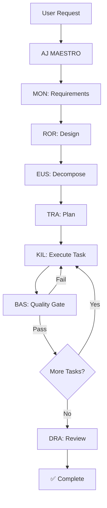

# Agent Guide: The 19-Agent Trinity Team

**Last Updated:** 2025-12-28
**Version:** 2.0.0

## Overview

Trinity Method deploys a specialized team of 19 AI agents to your project, each with distinct roles, tools, and responsibilities. This guide provides a comprehensive understanding of the agent system, when to use each agent, and how they work together.

## Table of Contents

- [Agent Categories](#agent-categories)
- [Planning Agents](#planning-agents)
- [Execution Agents](#execution-agents)
- [Support Agents](#support-agents)
- [Leadership Agents](#leadership-agents)
- [Infrastructure Agents](#infrastructure-agents)
- [Orchestration with AJ MAESTRO](#orchestration-with-aj-maestro)
- [Agent Selection Guide](#agent-selection-guide)
- [Agent Workflows](#agent-workflows)

---

## Agent Categories

Trinity's 19 agents are organized into 5 functional categories:

| Category           | Agent Count | Purpose                                                          |
| ------------------ | ----------- | ---------------------------------------------------------------- |
| **Planning**       | 4 agents    | Requirements analysis, design, task decomposition, planning      |
| **Execution**      | 3 agents    | Implementation, quality gates, code review                       |
| **Support**        | 4 agents    | Documentation, dependencies, configuration, refactoring          |
| **Leadership**     | 2 agents    | Strategic oversight, quality audits                              |
| **Infrastructure** | 6 agents    | Project structure, knowledge base, context, CI/CD, orchestration |

---

## Planning Agents

### MON (Requirements Analyst)

**Full Name:** MON - Requirements Analyst
**Role:** Requirements analysis, scale determination, acceptance criteria definition

**When to Use:**

- Starting a new feature or project
- Need to define clear requirements
- Determining project scale (Tiny, Small, Medium, Large, Epic)
- Creating acceptance criteria
- Analyzing user stories

**Tools Available:**

- Read, Write, Edit

**Typical Workflow:**

```
User Request → MON analyzes requirements → Scale determination →
Acceptance criteria → Handoff to ROR (Design Architect)
```

**Example Command:**

```
/trinity-requirements
```

**Key Outputs:**

- Requirements specification
- Scale classification (Tiny/Small/Medium/Large/Epic)
- Acceptance criteria
- Success metrics
- Handoff to next agent (ROR)

---

### ROR (Design Architect)

**Full Name:** ROR - Design Architect
**Role:** Technical design, Architecture Decision Records, Design Doc creation

**When to Use:**

- After requirements are defined (from MON)
- Need technical design documentation
- Making architectural decisions
- Creating ADRs (Architecture Decision Records)
- System design for complex features

**Tools Available:**

- Read, Write, Edit

**Typical Workflow:**

```
MON requirements → ROR creates technical design → ADRs documented →
Design Doc created → Handoff to TRA (Work Planner)
```

**Example Command:**

```
/trinity-design
```

**Key Outputs:**

- Technical design documentation
- Architecture Decision Records (ADRs)
- Design Doc with implementation approach
- Technology selection rationale
- Handoff to TRA

---

### EUS (Task Decomposer)

**Full Name:** EUS - Task Decomposer
**Role:** Atomic task breakdown, commit planning, TDD cycle enforcement

**When to Use:**

- After design is complete (from ROR)
- Breaking down large features into atomic tasks
- Planning commit strategy
- Enforcing Test-Driven Development (TDD)
- Creating granular task lists

**Tools Available:**

- Read, Write, Edit

**Typical Workflow:**

```
ROR design → EUS decomposes into atomic tasks → TDD cycles defined →
Commit plan created → Handoff to TRA (Work Planner)
```

**Example Command:**

```
/trinity-decompose
```

**Key Outputs:**

- Atomic task breakdown
- TDD RED-GREEN-REFACTOR cycles
- Commit planning
- Task sequencing
- Handoff to TRA

---

### TRA (Work Planner)

**Full Name:** TRA - Work Planner
**Role:** Implementation sequencing, BAS quality gates, timeline estimation

**When to Use:**

- After task decomposition (from EUS)
- Planning implementation sequence
- Setting up quality gates (BAS validation)
- Estimating timelines
- Creating detailed work plan

**Tools Available:**

- Read, Write, Edit

**Typical Workflow:**

```
EUS tasks → TRA sequences work → BAS gates defined →
Timeline estimated → Handoff to KIL (Task Executor)
```

**Example Command:**

```
/trinity-plan
```

**Key Outputs:**

- Implementation sequence
- BAS quality gate checkpoints
- Timeline estimation
- Detailed work plan
- Handoff to KIL

---

## Execution Agents

### KIL (Task Executor)

**Full Name:** KIL - Task Executor
**Role:** TDD implementation specialist executing atomic tasks following RED-GREEN-REFACTOR cycle

**When to Use:**

- Implementing atomic tasks (from TRA)
- Test-Driven Development (TDD) workflow
- Writing production code
- Following RED-GREEN-REFACTOR cycle
- Executing planned work

**Tools Available:**

- Read, Write, Edit, Glob, Grep, Bash, TodoWrite

**Typical Workflow:**

```
TRA work plan → KIL executes tasks (TDD cycle) →
Tests written (RED) → Code implemented (GREEN) →
Refactored → BAS validation → Next task
```

**Example Usage:**
KIL is typically invoked by `/trinity-orchestrate` rather than directly.

**Key Outputs:**

- Test implementation (RED phase)
- Feature implementation (GREEN phase)
- Refactored code
- Passing tests
- Handoff to BAS for validation

---

### BAS (Quality Gate)

**Full Name:** BAS - Quality Gate
**Role:** 6-phase quality gate validator executing after every KIL task

**When to Use:**

- After KIL completes a task
- Validating code quality
- Running automated tests
- Checking linting/formatting
- Type checking
- Security validation

**Tools Available:**

- Bash, Read, Edit, TodoWrite

**6-Phase Validation:**

1. **Syntax Check** - Code compiles/parses
2. **Type Check** - TypeScript/static types valid
3. **Linting** - ESLint/Clippy/Black passes
4. **Format Check** - Prettier/Rustfmt compliant
5. **Tests** - All tests pass
6. **Build** - Project builds successfully

**Typical Workflow:**

```
KIL completes task → BAS runs 6-phase validation →
All phases pass → Task approved → Next task OR
Phase fails → KIL fixes issue → BAS re-validates
```

**Example Usage:**
BAS is automatically invoked after KIL tasks in `/trinity-orchestrate`.

**Key Outputs:**

- Quality gate report (6 phases)
- Pass/fail for each phase
- Error details if failed
- Approval for next task or fix request

---

### DRA (Code Reviewer)

**Full Name:** DRA - Code Reviewer
**Role:** Design Doc compliance validator and quality escalation handler

**When to Use:**

- Validating code follows Design Doc
- Complex code review scenarios
- Quality escalation (when BAS fails repeatedly)
- Architectural compliance checking
- Post-implementation review

**Tools Available:**

- Read, Edit, Glob, Grep, TodoWrite

**Typical Workflow:**

```
Implementation complete → DRA reviews against Design Doc →
Compliance check → Quality assessment →
Approval or escalation
```

**Example Usage:**
DRA is invoked for complex reviews or when BAS validation requires escalation.

**Key Outputs:**

- Design Doc compliance report
- Code quality assessment
- Architectural adherence validation
- Recommendations or approvals

---

## Support Agents

### APO (Documentation Specialist)

**Full Name:** APO - Documentation Specialist
**Role:** Project documentation management, API documentation, inline comment generation

**When to Use:**

- Creating project documentation
- Generating API documentation
- Writing inline code comments
- Organizing docs/ directory
- Maintaining README.md, CHANGELOG.md

**Tools Available:**

- Read, Edit, Write

**Typical Workflow:**

```
Documentation need identified → APO creates/updates docs →
Organized in docs/ → README updated → Complete
```

**Example Commands:**

```
/trinity-readme
/trinity-docs
/trinity-changelog
```

**Key Outputs:**

- README.md with proper structure
- Organized docs/ directory (guides, api, architecture, reference)
- CHANGELOG.md (Keep-a-Changelog format)
- Inline code documentation
- API reference documentation

---

### BON (Dependency Manager)

**Full Name:** BON - Dependency Manager
**Role:** Package management and dependency security specialist

**When to Use:**

- Adding new dependencies
- Updating dependencies
- Security vulnerability audits
- Dependency conflict resolution
- Package.json/requirements.txt management

**Tools Available:**

- Bash, Read, Edit

**Typical Workflow:**

```
Dependency need → BON evaluates options →
Security audit → Adds dependency →
Package manager files updated → Tests pass
```

**Key Outputs:**

- Updated package.json/requirements.txt/Cargo.toml
- Dependency security audit
- Vulnerability resolution
- Dependency justification documentation

---

### CAP (Configuration Specialist)

**Full Name:** CAP - Configuration Specialist
**Role:** Configuration file and environment variable management specialist

**When to Use:**

- Creating configuration files
- Environment variable management
- .env file setup
- Framework-specific configs (tsconfig.json, pyproject.toml, etc.)
- CI/CD configuration

**Tools Available:**

- Read, Write, Edit, Bash

**Typical Workflow:**

```
Configuration need → CAP creates config files →
Environment variables defined →
Documentation updated → Configuration tested
```

**Key Outputs:**

- Configuration files (tsconfig.json, .env, etc.)
- Environment variable documentation
- Configuration best practices
- Framework-specific settings

---

### URO (Refactoring Specialist)

**Full Name:** URO - Refactoring Specialist
**Role:** Code refactoring and technical debt reduction specialist

**When to Use:**

- Refactoring existing code
- Reducing technical debt
- Improving code quality
- Performance optimization
- Code smell elimination

**Tools Available:**

- Read, Edit, Grep, Glob, Bash

**Typical Workflow:**

```
Technical debt identified → URO plans refactoring →
Code refactored → Tests pass →
Technical debt reduced → Documentation updated
```

**Key Outputs:**

- Refactored codebase
- Technical debt reduction
- Improved code quality
- Performance improvements
- Updated documentation

---

## Leadership Agents

### ALY (Chief Technology Officer)

**Full Name:** ALY - Chief Technology Officer
**Role:** Strategic leadership and session continuity management for Trinity Method implementation

**When to Use:**

- Starting a new Trinity session
- Continuing work after interruption
- Ending a session and archiving work
- Strategic project oversight
- High-level decision making

**Tools Available:**

- Read, Write, Edit

**Typical Workflow:**

```
/trinity-start → ALY session initialization → Work performed →
/trinity-continue → ALY restores context → Work continues →
/trinity-end → ALY archives session
```

**Example Commands:**

```
/trinity-start
/trinity-continue
/trinity-end
```

**Key Outputs:**

- Session initialization
- Context restoration
- Work archival to trinity/archive/
- Strategic guidance
- Session management

---

### JUNO (Quality Auditor)

**Full Name:** JUNO - Quality Auditor
**Role:** Comprehensive Trinity v2.0 deployment audit and quality assurance

**When to Use:**

- Auditing Trinity deployment
- Verifying all 64 components deployed correctly
- Quality assurance checks
- Compliance validation
- Post-deployment verification

**Tools Available:**

- Read, Bash, Glob, Grep

**Typical Workflow:**

```
Trinity deployed → /trinity-audit → JUNO audits all components →
Verification report → Issues identified or approval
```

**Example Command:**

```
/trinity-audit
```

**Key Outputs:**

- Trinity deployment audit report
- Component verification (64 components)
- Quality assurance report
- Compliance validation
- Recommendations

---

## Infrastructure Agents

### TAN (Structure Specialist)

**Full Name:** TAN - Structure Specialist
**Role:** Trinity Method v2.0 folder structure verification and validation

**When to Use:**

- Verifying Trinity structure
- Validating directory organization
- Ensuring proper file placement
- Structure compliance checking

**Tools Available:**

- Bash, Read, Edit, Glob, Grep

**Typical Workflow:**

```
Structure verification needed → TAN validates structure →
14 directories verified → File organization checked →
Report generated
```

**Example Command:**

```
/trinity-verify
```

**Key Outputs:**

- Structure verification report
- Directory compliance validation
- File organization assessment
- Recommendations for corrections

---

### ZEN (Knowledge Base Specialist)

**Full Name:** ZEN - Knowledge Base Specialist
**Role:** Creates comprehensive documentation capturing project architecture and methodology with v2.0 best practices integration

**When to Use:**

- Creating knowledge base documentation
- Capturing project architecture
- Documenting methodology
- Maintaining trinity/knowledge-base/

**Tools Available:**

- All tools

**Typical Workflow:**

```
Knowledge base need → ZEN creates documentation →
trinity/knowledge-base/ updated → Architecture captured →
Best practices integrated
```

**Key Outputs:**

- trinity/knowledge-base/ documentation
- ARCHITECTURE.md
- Trinity.md (project-specific)
- Methodology documentation
- Best practices integration

---

### INO (Context Specialist)

**Full Name:** INO - Context Specialist
**Role:** CLAUDE.md hierarchy management and ISSUES.md database creation

**When to Use:**

- Managing CLAUDE.md context files
- Creating ISSUES.md database
- Context hierarchy management
- Known issues tracking

**Tools Available:**

- Read, Write, Edit, Bash

**Typical Workflow:**

```
Context management needed → INO manages CLAUDE.md hierarchy →
ISSUES.md database created → Context organized →
Issues tracked
```

**Key Outputs:**

- CLAUDE.md hierarchy (root, trinity/, src/)
- ISSUES.md database
- Context organization
- Issue tracking system

---

### EIN (CI/CD Specialist)

**Full Name:** EIN - CI/CD Specialist
**Role:** Continuous Integration/Continuous Deployment automation with BAS quality gate integration

**When to Use:**

- Setting up CI/CD pipelines
- Integrating BAS quality gates
- Automating deployments
- GitHub Actions/GitLab CI/CircleCI/Jenkins setup

**Tools Available:**

- Read, Write, Edit, Bash

**Typical Workflow:**

```
CI/CD need → EIN creates workflow → BAS gates integrated →
Pipeline tested → Automated deployment configured
```

**Key Outputs:**

- CI/CD workflow files (.github/workflows/, .gitlab-ci.yml, etc.)
- BAS quality gate integration
- Automated testing pipelines
- Deployment automation

---

### AJ MAESTRO (Orchestration Coordinator)

**Full Name:** AJ MAESTRO - Orchestration Coordinator
**Role:** Master orchestrator coordinating multi-agent workflows with AJ (CC) for complex tasks

**When to Use:**

- Complex multi-agent tasks
- Orchestrating Planning → Execution workflow
- Coordinating multiple agents
- Complex feature implementation
- Full Trinity Method workflow

**Tools Available:**

- All tools (coordinates all agents)

**Typical Workflow:**

```
Complex task → AJ MAESTRO orchestrates →
MON → ROR → EUS → TRA → KIL → BAS loop →
DRA review → Complete
```

**Example Command:**

```
/trinity-orchestrate
```

**Key Outputs:**

- Coordinated multi-agent execution
- Full Planning → Execution workflow
- Quality-gated implementation
- Complete feature delivery

---

## Orchestration with AJ MAESTRO

AJ MAESTRO is the master orchestrator that coordinates complex multi-agent workflows. Here's how it works:

### Full Trinity Workflow



### When to Use `/trinity-orchestrate`

Use AJ MAESTRO orchestration for:

- **Complex Features** - Requires planning, design, and multiple implementation tasks
- **Full Trinity Workflow** - Want complete MON → ROR → EUS → TRA → KIL → BAS cycle
- **Quality-Gated Development** - Need BAS validation after every task
- **Multi-Step Implementation** - Breaking down large work into atomic tasks

### When to Use Individual Agents

Use individual agents directly for:

- **Single-Purpose Tasks** - Only need requirements (MON) or design (ROR)
- **Documentation** - APO for docs, changelog, README updates
- **Refactoring** - URO for targeted refactoring
- **Audits** - JUNO for deployment audits
- **Session Management** - ALY for start/continue/end

---

## Agent Selection Guide

### Decision Tree

```
Is this a NEW feature or complex task?
├─ YES → Use /trinity-orchestrate (AJ MAESTRO)
│         → Full workflow: MON → ROR → EUS → TRA → KIL → BAS
└─ NO → Select individual agent:

        Need to understand requirements?
        └─ MON (/trinity-requirements)

        Need technical design?
        └─ ROR (/trinity-design)

        Need to break down tasks?
        └─ EUS (/trinity-decompose)

        Need implementation plan?
        └─ TRA (/trinity-plan)

        Need documentation?
        └─ APO (/trinity-readme, /trinity-docs, /trinity-changelog)

        Need to refactor code?
        └─ URO (direct invocation)

        Need to audit Trinity deployment?
        └─ JUNO (/trinity-audit)

        Starting/ending session?
        └─ ALY (/trinity-start, /trinity-continue, /trinity-end)
```

---

## Agent Workflows

### Planning Workflow (MON → ROR → EUS → TRA)

**Use Case:** Planning a new feature from scratch

```bash
# Step 1: Analyze requirements
/trinity-requirements

# Step 2: Create technical design
/trinity-design

# Step 3: Decompose into atomic tasks
/trinity-decompose

# Step 4: Create implementation plan
/trinity-plan
```

**Agents Involved:** MON → ROR → EUS → TRA

**Expected Duration:** 30-60 minutes for complex features

**Outputs:**

- Requirements specification with acceptance criteria
- Technical design with ADRs
- Atomic task breakdown with TDD cycles
- Detailed implementation plan with BAS quality gates

---

### Execution Workflow (KIL → BAS Loop)

**Use Case:** Implementing planned tasks with quality gates

```bash
# Orchestrated execution
/trinity-orchestrate
```

**Agents Involved:** KIL → BAS (loop) → DRA (final review)

**Expected Duration:** Varies by task complexity

**Outputs:**

- Test implementation (RED phase)
- Feature implementation (GREEN phase)
- Refactored code
- BAS quality gate validation (6 phases)
- DRA compliance review

---

### Documentation Workflow (APO)

**Use Case:** Creating and organizing project documentation

```bash
# Update README
/trinity-readme

# Organize docs/ directory
/trinity-docs

# Maintain changelog
/trinity-changelog
```

**Agent Involved:** APO

**Expected Duration:** 5-15 minutes

**Outputs:**

- Comprehensive README.md
- Organized docs/ directory (guides, api, architecture, reference)
- Updated CHANGELOG.md

---

### Session Management Workflow (ALY)

**Use Case:** Managing Trinity sessions

```bash
# Start new session
/trinity-start

# Continue after interruption
/trinity-continue

# End session and archive
/trinity-end
```

**Agent Involved:** ALY

**Expected Duration:** 2-5 minutes per command

**Outputs:**

- Session initialization/restoration
- Work archival to trinity/archive/
- Context management

---

## Best Practices

### 1. Use AJ MAESTRO for Complex Features

For any non-trivial feature, use `/trinity-orchestrate` to get the full Planning → Execution workflow with quality gates.

### 2. Trust the Quality Gates

BAS runs 6-phase validation after every KIL task. If BAS fails, fix the issue before proceeding.

### 3. Follow the Agent Handoffs

Each planning agent hands off to the next: MON → ROR → EUS → TRA → KIL. Don't skip steps.

### 4. Document with APO

After implementation, use `/trinity-readme`, `/trinity-docs`, and `/trinity-changelog` to keep documentation current.

### 5. Use ALY for Session Management

Always use `/trinity-start`, `/trinity-continue`, and `/trinity-end` to properly manage Trinity sessions.

### 6. Audit with JUNO

After deploying Trinity or making infrastructure changes, run `/trinity-audit` to verify everything is correct.

### 7. Leverage Specialists

Use specialist agents for focused tasks:

- **URO** for refactoring
- **BON** for dependency management
- **CAP** for configuration
- **EIN** for CI/CD

---

## Troubleshooting

### Agent Not Responding?

- Ensure Trinity is properly deployed (`/trinity-verify`)
- Check `.claude/agents/` directory contains all 19 agent files
- Verify CLAUDE.md context hierarchy is intact

### BAS Quality Gate Failing?

- Review the 6-phase validation output
- Fix the specific phase that failed (syntax, types, linting, formatting, tests, build)
- Re-run BAS validation

### Agent Handoff Not Working?

- Ensure previous agent completed successfully
- Check work products are in expected locations (trinity/knowledge-base/, etc.)
- Verify agent outputs match expected format

---

## Additional Resources

- **Agent Directory:** `.claude/EMPLOYEE-DIRECTORY.md` (after Trinity deployment)
- **Slash Commands:** See [Slash Commands Reference](../reference/slash-commands-reference.md)
- **Trinity Architecture:** See [Architecture Overview](../architecture/overview.md)
- **Getting Started:** See [Getting Started Guide](getting-started.md)

---

**Trinity Method SDK v2.0.0** - Investigation-first development methodology
