# CLI Command Flow Diagram

## Trinity Deploy Command Flow

```mermaid
flowchart TD
    START([User: trinity deploy]) --> VALIDATE_ENV[Validate Environment<br/>Node.js ≥16.9.0]
    VALIDATE_ENV --> CHECK_EXISTING{Trinity Already<br/>Deployed?}

    CHECK_EXISTING -->|Yes| PROMPT_OVERWRITE{Prompt:<br/>Overwrite?}
    PROMPT_OVERWRITE -->|No| ABORT([Abort Deployment])
    PROMPT_OVERWRITE -->|Yes| BACKUP[Create Backup<br/>trinity/backups/]

    CHECK_EXISTING -->|No| DETECT_FRAMEWORK[Detect Framework<br/>package.json/requirements.txt<br/>Cargo.toml/pubspec.yaml/go.mod]
    BACKUP --> DETECT_FRAMEWORK

    DETECT_FRAMEWORK --> FRAMEWORK_RESULT{Framework<br/>Detected?}
    FRAMEWORK_RESULT -->|No| PROMPT_FRAMEWORK[Prompt User:<br/>Select Framework]
    FRAMEWORK_RESULT -->|Yes| DETECT_PM[Detect Package Manager<br/>npm/yarn/pnpm/pip/cargo/flutter/go]
    PROMPT_FRAMEWORK --> DETECT_PM

    DETECT_PM --> PROMPT_LINT[Interactive Prompt:<br/>Select Linting Tools]
    PROMPT_LINT --> PROMPT_CI[Interactive Prompt:<br/>Select CI/CD Platform]
    PROMPT_CI --> PROMPT_NAME[Interactive Prompt:<br/>Project Name]

    PROMPT_NAME --> CREATE_DIRS[Create Directory Structure<br/>14 directories]
    CREATE_DIRS --> DEPLOY_AGENTS[Deploy 19 Agents<br/>.claude/agents/]
    DEPLOY_AGENTS --> DEPLOY_COMMANDS[Deploy 20 Slash Commands<br/>.claude/commands/]
    DEPLOY_COMMANDS --> DEPLOY_KB[Deploy Knowledge Base<br/>trinity/knowledge-base/]
    DEPLOY_KB --> DEPLOY_TEMPLATES[Deploy Templates<br/>trinity/templates/]
    DEPLOY_TEMPLATES --> DEPLOY_LINT[Deploy Linting Config<br/>ESLint/Black/Clippy/etc.]
    DEPLOY_LINT --> DEPLOY_CI[Deploy CI/CD Workflows<br/>.github/workflows/etc.]

    DEPLOY_CI --> UPDATE_GITIGNORE[Update .gitignore<br/>Add Trinity entries]
    UPDATE_GITIGNORE --> CREATE_VERSION[Create VERSION File<br/>trinity/VERSION]
    CREATE_VERSION --> VERIFY[Verify Deployment<br/>Check all 64 components]

    VERIFY --> VERIFY_RESULT{All Components<br/>Present?}
    VERIFY_RESULT -->|No| ERROR([❌ Deployment Failed<br/>Rollback from backup])
    VERIFY_RESULT -->|Yes| SUCCESS([✅ Deployment Complete<br/>64 components deployed])

    style START fill:#e1f5ff
    style SUCCESS fill:#e1ffe1
    style ERROR fill:#ffe1e1
    style ABORT fill:#fff4e1
    style DEPLOY_AGENTS fill:#f0e1ff
    style DEPLOY_COMMANDS fill:#f0e1ff
    style DEPLOY_KB fill:#ffe1f0
```



## Trinity Update Command Flow

```mermaid
flowchart TD
    START([User: trinity update]) --> CHECK_DEPLOYED{Trinity<br/>Deployed?}

    CHECK_DEPLOYED -->|No| ERROR_NOT_DEPLOYED([❌ Error:<br/>Trinity not deployed])
    CHECK_DEPLOYED -->|Yes| READ_VERSION[Read Current Version<br/>trinity/VERSION]

    READ_VERSION --> COMPARE_VERSION{Version Check:<br/>Update Available?}
    COMPARE_VERSION -->|No| UP_TO_DATE([ℹ️ Already up-to-date])
    COMPARE_VERSION -->|Yes| PROMPT_UPDATE{Prompt:<br/>Update to latest?}

    PROMPT_UPDATE -->|No| CANCEL([Update Cancelled])
    PROMPT_UPDATE -->|Yes| CREATE_BACKUP[Create Timestamped Backup<br/>trinity/backups/backup-{timestamp}.tar.gz]

    CREATE_BACKUP --> PRESERVE_USER[Preserve User Content<br/>ARCHITECTURE.md, ISSUES.md<br/>To-do.md, Technical-Debt.md]
    PRESERVE_USER --> REMOVE_OLD[Remove Old Templates<br/>Keep user content + backups]

    REMOVE_OLD --> DEPLOY_NEW[Deploy New Templates<br/>Same flow as 'deploy']
    DEPLOY_NEW --> RESTORE_USER[Restore User Content<br/>Merge preserved files]

    RESTORE_USER --> UPDATE_VERSION[Update VERSION File<br/>Write new version]
    UPDATE_VERSION --> VERIFY[Verify Update<br/>Check all components]

    VERIFY --> VERIFY_RESULT{Update<br/>Successful?}
    VERIFY_RESULT -->|No| ROLLBACK[Rollback from Backup<br/>Extract backup tarball]
    ROLLBACK --> ERROR_ROLLBACK([❌ Update Failed<br/>Rolled back to previous version])

    VERIFY_RESULT -->|Yes| CLEANUP_PROMPT{Prompt:<br/>Remove backup?}
    CLEANUP_PROMPT -->|Yes| CLEANUP[Remove Backup File]
    CLEANUP_PROMPT -->|No| KEEP_BACKUP[Keep Backup]

    CLEANUP --> SUCCESS([✅ Update Complete<br/>Backup removed])
    KEEP_BACKUP --> SUCCESS_BACKUP([✅ Update Complete<br/>Backup preserved])

    style START fill:#e1f5ff
    style SUCCESS fill:#e1ffe1
    style SUCCESS_BACKUP fill:#e1ffe1
    style ERROR_NOT_DEPLOYED fill:#ffe1e1
    style ERROR_ROLLBACK fill:#ffe1e1
    style UP_TO_DATE fill:#fff4e1
    style CANCEL fill:#fff4e1
```

## Command Execution Details

### Deploy Command

- **Entry Point**: `src/cli/commands/deploy.ts`
- **Average Execution Time**: 2-3 seconds
- **User Prompts**: 4 interactive prompts (framework, linting, CI/CD, project name)
- **Components Deployed**: 64 files across 14 directories
- **Validation**: Directory structure verification, component count check

### Update Command

- **Entry Point**: `src/cli/commands/update.ts`
- **Average Execution Time**: 3-5 seconds (includes backup creation)
- **User Prompts**: 2 prompts (confirm update, cleanup backup)
- **Backup Strategy**: Timestamped tar.gz in `trinity/backups/`
- **Preservation**: User-created content always preserved
- **Rollback**: Automatic rollback on any failure
