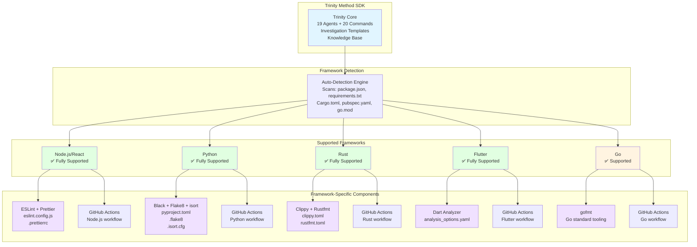
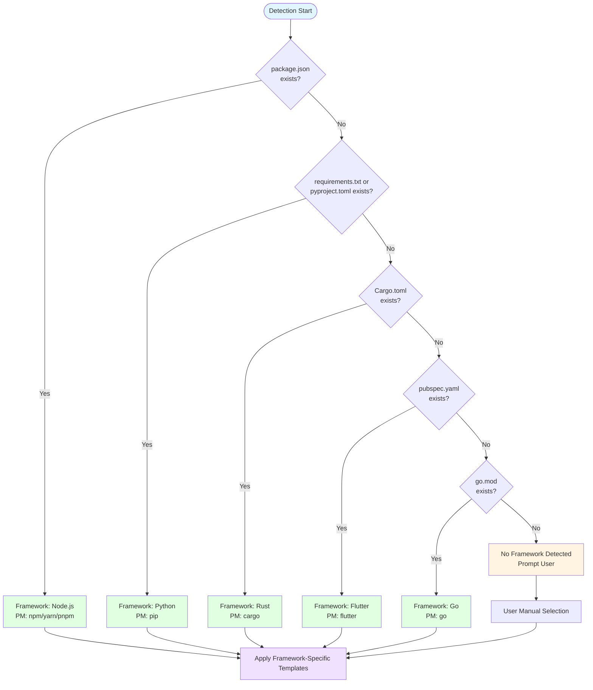

# Multi-Framework Support Matrix

## Framework Support Overview

## Framework Compatibility Matrix

| Feature                 | Node.js | Python | Rust | Flutter | Go  |
| ----------------------- | ------- | ------ | ---- | ------- | --- |
| **Core Trinity**        |
| 19 Agents               | ✅      | ✅     | ✅   | ✅      | ✅  |
| 20 Slash Commands       | ✅      | ✅     | ✅   | ✅      | ✅  |
| Investigation Templates | ✅      | ✅     | ✅   | ✅      | ✅  |
| Knowledge Base          | ✅      | ✅     | ✅   | ✅      | ✅  |
| **Linting**             |
| ESLint + Prettier       | ✅      | ❌     | ❌   | ❌      | ❌  |
| Black + Flake8 + isort  | ❌      | ✅     | ❌   | ❌      | ❌  |
| Clippy + Rustfmt        | ❌      | ❌     | ✅   | ❌      | ❌  |
| Dart Analyzer           | ❌      | ❌     | ❌   | ✅      | ❌  |
| gofmt                   | ❌      | ❌     | ❌   | ❌      | ✅  |
| **Pre-commit Hooks**    | ✅      | ✅     | ✅   | ✅      | ⚠️  |
| **CI/CD**               |
| GitHub Actions          | ✅      | ✅     | ✅   | ✅      | ✅  |
| GitLab CI               | ✅      | ✅     | ✅   | ✅      | ✅  |
| CircleCI                | ✅      | ✅     | ⚠️   | ⚠️      | ⚠️  |
| Jenkins                 | ✅      | ✅     | ⚠️   | ⚠️      | ⚠️  |
| **Package Managers**    |
| npm/yarn/pnpm           | ✅      | ❌     | ❌   | ❌      | ❌  |
| pip                     | ❌      | ✅     | ❌   | ❌      | ❌  |
| cargo                   | ❌      | ❌     | ✅   | ❌      | ❌  |
| flutter                 | ❌      | ❌     | ❌   | ✅      | ❌  |
| go modules              | ❌      | ❌     | ❌   | ❌      | ✅  |

**Legend:**

- ✅ Fully Supported
- ⚠️ Partial Support (community templates available)
- ❌ Not Applicable

## Framework Detection Logic

## Framework-Specific Template Deployment

### Node.js/React

**Deployed Files:**

- `.eslintrc.js` or `eslint.config.js` (flat config)
- `.prettierrc`
- `.eslintignore`
- `.prettierignore`
- `.pre-commit-config.yaml` (ESLint + Prettier hooks)
- `.github/workflows/nodejs.yml` (CI workflow)

**Package Manager Detection:**

1. Check for `package-lock.json` → npm
2. Check for `yarn.lock` → yarn
3. Check for `pnpm-lock.yaml` → pnpm
4. Default: npm

### Python

**Deployed Files:**

- `pyproject.toml` (Black + isort config)
- `.flake8`
- `.isort.cfg`
- `.pre-commit-config.yaml` (Black + Flake8 + isort hooks)
- `.github/workflows/python.yml` (CI workflow)

**Python Version Detection:**

- Read from `pyproject.toml` or `setup.py`
- Default: 3.8+

### Rust

**Deployed Files:**

- `clippy.toml`
- `rustfmt.toml`
- `.pre-commit-config.yaml` (Clippy + Rustfmt hooks)
- `.github/workflows/rust.yml` (CI workflow)

**Edition Detection:**

- Read from `Cargo.toml`
- Default: 2021 edition

### Flutter

**Deployed Files:**

- `analysis_options.yaml`
- `.pre-commit-config.yaml` (Dart Analyzer hooks)
- `.github/workflows/flutter.yml` (CI workflow)

**Flutter Version:**

- Detected from `pubspec.yaml`
- Default: Latest stable

### Go

**Deployed Files:**

- `.github/workflows/go.yml` (CI workflow with gofmt)
- Basic pre-commit support

**Go Version:**

- Read from `go.mod`
- Default: 1.21+

## CI/CD Platform Support

| Platform           | Template Location      | Supported Frameworks                   |
| ------------------ | ---------------------- | -------------------------------------- |
| **GitHub Actions** | `.github/workflows/`   | Node.js, Python, Rust, Flutter, Go     |
| **GitLab CI**      | `.gitlab-ci.yml`       | Node.js, Python, Rust, Flutter, Go     |
| **CircleCI**       | `.circleci/config.yml` | Node.js, Python (others via community) |
| **Jenkins**        | `Jenkinsfile`          | Node.js, Python (others via community) |

## Extension Points

Trinity Method SDK can be extended to support additional frameworks by:

1. **Adding Framework Detection**: Update `src/cli/utils/stackDetection.ts`
2. **Creating Templates**: Add framework-specific templates to `src/templates/linting/`
3. **Updating Variable Maps**: Add framework variables to template processor
4. **Adding CI/CD Workflows**: Create platform-specific workflow templates

## Community Contributions

Community-contributed framework support available for:

- **Java** (Maven/Gradle)
- **C#/.NET** (.NET CLI)
- **PHP** (Composer)
- **Ruby** (Bundler)

See [CONTRIBUTING.md](../../CONTRIBUTING.md) for framework contribution guidelines.
