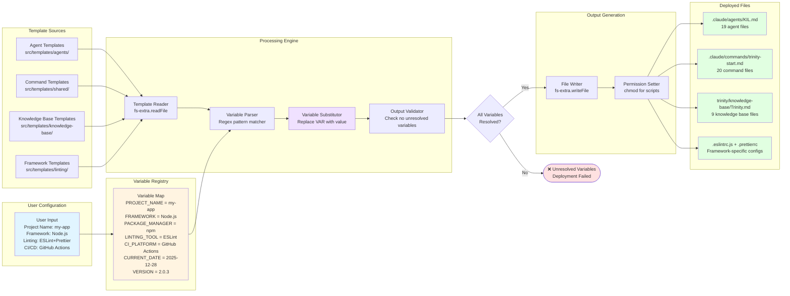

# Template Processing Pipeline



## Variable Substitution Example

### Template File: `src/templates/knowledge-base/Trinity.md.template`

````markdown
# Trinity Method - {{PROJECT_NAME}}

**Framework:** {{FRAMEWORK}}
**Package Manager:** {{PACKAGE_MANAGER}}
**Deployed:** {{CURRENT_DATE}}
**Version:** {{VERSION}}

## Quick Start

```bash
{{PACKAGE_MANAGER}} install
{{PACKAGE_MANAGER}} test
```
````

## Linting

This project uses {{LINTING_TOOL}} for code quality.

````

### After Processing → `trinity/knowledge-base/Trinity.md`

```markdown
# Trinity Method - my-app

**Framework:** Node.js
**Package Manager:** npm
**Deployed:** 2025-12-29
**Version:** 2.0.3

## Quick Start

```bash
npm install
npm test
````

## Linting

This project uses ESLint for code quality.

```

## Supported Variables

| Variable | Source | Example Value |
|----------|--------|---------------|
| `{{PROJECT_NAME}}` | User input or package.json | `my-app` |
| `{{FRAMEWORK}}` | Auto-detected or user input | `Node.js`, `Python`, `Rust`, `Flutter`, `Go` |
| `{{PACKAGE_MANAGER}}` | Auto-detected from framework | `npm`, `yarn`, `pnpm`, `pip`, `cargo`, `flutter`, `go` |
| `{{LINTING_TOOL}}` | User selection | `ESLint`, `Black`, `Clippy`, `Dart Analyzer` |
| `{{CI_PLATFORM}}` | User selection | `GitHub Actions`, `GitLab CI`, `CircleCI`, `Jenkins` |
| `{{CURRENT_DATE}}` | System date | `2025-12-28` |
| `{{VERSION}}` | SDK version | `2.0.3` |
| `{{NODE_VERSION}}` | Minimum Node.js version | `16.9.0` |

## Processing Implementation

**Location**: `src/cli/utils/templateProcessor.ts`

**Key Functions**:
- `processTemplate(templatePath, variables)` - Main processing function
- `extractVariables(templateContent)` - Parse {{VAR}} syntax
- `substituteVariables(content, variableMap)` - Replace variables
- `validateOutput(processedContent)` - Ensure no unresolved variables

**Performance**:
- In-memory processing for speed
- Async/await for non-blocking I/O
- Average processing time: ~50-100ms per template
- Batch processing for multiple files: ~2-3 seconds for 64 files

## Error Handling

- **Unresolved Variables**: Deployment fails if any `{{VAR}}` remains after substitution
- **Missing Templates**: Error if source template file not found
- **Write Failures**: Automatic rollback on file system errors
- **Permission Errors**: Validation of write permissions before processing
```
