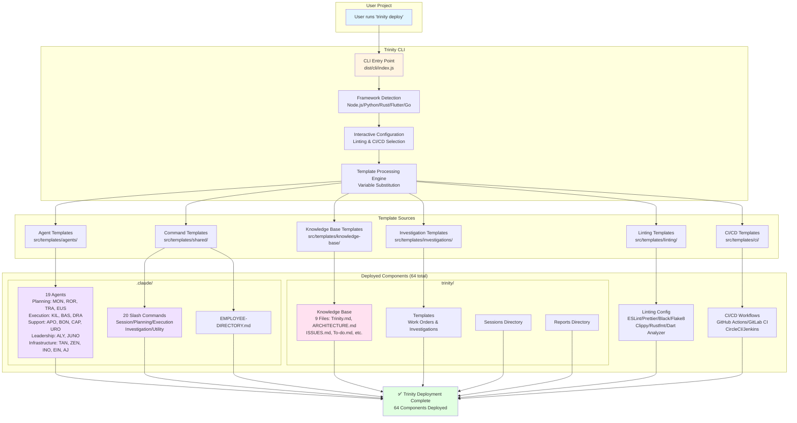

# Trinity Deployment Architecture

## Deployment Flow

1. **User Initiation**: User runs `trinity deploy` in their project directory
2. **Framework Detection**: CLI detects project framework (Node.js, Python, Rust, Flutter, Go)
3. **Interactive Configuration**: User selects linting tools and CI/CD platform
4. **Template Processing**: Variable substitution ({{PROJECT_NAME}}, {{FRAMEWORK}}, etc.)
5. **Component Deployment**: 64 components deployed to `.claude/` and `trinity/` directories
6. **Validation**: Directory structure verified, .gitignore updated

## Components Deployed

- **19 Agents** → `.claude/agents/`
- **20 Slash Commands** → `.claude/commands/`
- **Employee Directory** → `.claude/EMPLOYEE-DIRECTORY.md`
- **9 Knowledge Base Files** → `trinity/knowledge-base/`
- **Investigation Templates** → `trinity/templates/`
- **Framework-specific Linting** → Root directory (ESLint, Black, Clippy, etc.)
- **CI/CD Workflows** → `.github/workflows/`, `.gitlab-ci.yml`, etc.
