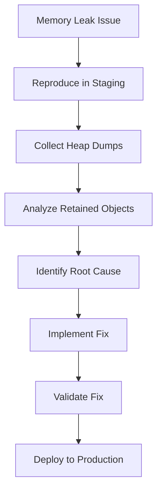

# Slash Commands Reference

**Trinity Version:** 2.1.0
**Last Updated:** 2026-01-12

Complete reference for Trinity Method's 21 slash commands.

## Overview

Trinity Method deploys 21 slash commands to `.claude/commands/` organized by category:

- **Session Management** (3 commands)
- **Planning** (4 commands)
- **Execution** (3 commands)
- **Investigation** (3 commands)
- **Infrastructure** (1 command)
- **Maintenance** (4 commands)
- **Utility** (3 commands)

---

## Session Management Commands

### `/trinity-start`

**Location:** `.claude/commands/session/trinity-start.md`
**Agent:** ALY (Chief Technology Officer)

**Purpose:** Initialize a new Trinity Method session

**When to Use:**

- Starting work on a new feature or task
- Beginning a new work session
- After deploying Trinity for the first time

**What It Does:**

1. Verifies Trinity deployment (agents, commands, knowledge base)
2. Reviews project context (CLAUDE.md hierarchy)
3. Checks for existing sessions in `.claude/trinity/sessions/`
4. Initializes new session with timestamp
5. Sets up session tracking
6. Provides strategic guidance on next steps

**Usage:**

```text
/trinity-start
```

**Expected Output:**

- Session initialization confirmation
- Project context summary
- Strategic recommendations
- Next steps (typically: define requirements with MON)

**Example:**

```text
User: /trinity-start

ALY: Trinity Session Initialization

✅ Trinity Deployment Verified
- 18 agents deployed
- 21 slash commands active
- Knowledge base initialized

📋 Project Context
- Framework: Node.js
- Project: my-app
- Recent Activity: Initial deployment

🚀 Session Started: 2025-12-28T10:30:00

Recommended Next Steps:
1. Define requirements with /trinity-requirements
2. Or begin with investigation: /trinity-create-investigation

How can I assist you today?
```

---

### `/trinity-continue`

**Location:** `.claude/commands/session/trinity-continue.md`
**Agent:** ALY (Chief Technology Officer)

**Purpose:** Continue work after session interruption or context reset

**When to Use:**

- Returning to work after a break
- After Claude Code context window reset
- Continuing from previous session
- Resuming interrupted work

**What It Does:**

1. Scans `.claude/trinity/sessions/` for recent sessions
2. Reads session context and work products
3. Reviews knowledge base updates (ARCHITECTURE.md, ISSUES.md, To-do.md)
4. Restores work context
5. Summarizes progress and next steps
6. Re-establishes strategic direction

**Usage:**

```text
/trinity-continue
```

**Expected Output:**

- Previous session summary
- Work completed
- Current state
- Recommended next actions

**Example:**

```text
User: /trinity-continue

ALY: Trinity Session Continuation

📂 Latest Session: 2025-12-28T10:30:00

Progress Summary:
✅ Requirements defined (MON)
✅ Technical design completed (ROR)
🔄 Task decomposition in progress (EUS)

Current State:
- 12 atomic tasks defined
- 8 remaining to decompose
- Design Doc: .claude/trinity/knowledge-base/design-doc-feature-x.md

Next Steps:
1. Complete task decomposition (EUS)
2. Create implementation plan (TRA)
3. Begin execution (KIL)

Ready to continue. What would you like to work on?
```

---

### `/trinity-end`

**Location:** `.claude/commands/session/trinity-end.md`
**Agent:** ALY (Chief Technology Officer)

**Purpose:** End session and archive work

**When to Use:**

- Completing work session
- Finishing a feature or task
- Archiving session for future reference
- Proper session cleanup

**What It Does:**

1. Reviews session work products
2. Summarizes accomplishments
3. Archives session to `.claude/trinity/archive/session-{timestamp}/`
4. Updates knowledge base with final state
5. Creates session report
6. Provides recommendations for next session

**Usage:**

```text
/trinity-end
```

**Expected Output:**

- Session summary
- Accomplishments list
- Archived location
- Next session recommendations

**Example:**

```text
User: /trinity-end

ALY: Trinity Session End

Session Summary (2025-12-28T10:30:00 - 2025-12-28T16:45:00)
Duration: 6h 15m

Accomplishments:
✅ Feature requirements defined (MON)
✅ Technical design with 4 ADRs (ROR)
✅ 24 atomic tasks decomposed (EUS)
✅ Implementation plan with BAS gates (TRA)
✅ 8 tasks implemented and validated (KIL + BAS)
✅ Documentation updated (APO)

Work Products:
- .claude/trinity/knowledge-base/requirements-feature-x.md
- .claude/trinity/knowledge-base/design-doc-feature-x.md
- .claude/trinity/knowledge-base/implementation-plan-feature-x.md

📦 Session Archived: .claude/trinity/archive/session-2025-12-28T10-30-00/

Next Session Recommendations:
1. Continue implementation (16 tasks remaining)
2. Review with /trinity-continue
3. Focus on KIL → BAS execution loop

Session ended successfully.
```

---

## Planning Commands

### `/trinity-requirements`

**Location:** `.claude/commands/planning/trinity-requirements.md`
**Agent:** MON (Requirements Analyst)

**Purpose:** Analyze requirements, determine scale, define acceptance criteria

**When to Use:**

- Starting a new feature
- Need to understand scope
- Defining user requirements
- Creating acceptance criteria
- Determining project scale

**What It Does:**

1. Analyzes user requirements
2. Asks clarifying questions
3. Determines scale (Tiny, Small, Medium, Large, Epic)
4. Defines acceptance criteria
5. Creates requirements specification
6. Recommends next agent (ROR)

**Usage:**

```text
/trinity-requirements
```

**Expected Output:**

- Requirements specification document
- Scale classification
- Acceptance criteria
- Success metrics
- Handoff to ROR (Design Architect)

**Scale Definitions:**

- **Tiny:** < 1 day, < 5 tasks, simple change
- **Small:** 1-3 days, 5-15 tasks, single feature
- **Medium:** 1-2 weeks, 15-30 tasks, multiple features
- **Large:** 2-4 weeks, 30-60 tasks, major feature set
- **Epic:** > 1 month, 60+ tasks, large-scale initiative

**Example:**

```text
User: /trinity-requirements
I need to add user authentication to my app.

MON: Requirements Analysis

Analyzing: User authentication system

Clarifying Questions:
1. Authentication method? (Email/password, OAuth, SSO, Magic link)
2. User registration flow? (Self-service, invite-only, admin-created)
3. Password requirements? (Complexity rules, reset flow)
4. Session management? (JWT, session cookies, duration)
5. Multi-factor authentication required?
6. Social login providers? (Google, GitHub, etc.)

[User provides answers]

Requirements Specification:
- Email/password authentication
- Self-service registration with email verification
- Password complexity: 8+ chars, uppercase, number, special char
- JWT-based sessions (7-day expiration, refresh tokens)
- Optional 2FA with TOTP (Google Authenticator)
- Social login: Google, GitHub

Scale: MEDIUM (1-2 weeks, ~25 tasks)
Complexity: Moderate (security-critical, well-established patterns)

Acceptance Criteria:
✓ Users can register with email/password
✓ Email verification required before login
✓ Password reset flow via email
✓ JWT access tokens (15min) + refresh tokens (7day)
✓ Optional 2FA enrollment and verification
✓ Social login integration (Google, GitHub)
✓ Secure password hashing (bcrypt)
✓ Rate limiting on auth endpoints
✓ Comprehensive test coverage (>90%)

Next Step: Technical design with /trinity-design (ROR)
```

---

### `/trinity-design`

**Location:** `.claude/commands/planning/trinity-design.md`
**Agent:** ROR (Design Architect)

**Purpose:** Create technical design, Architecture Decision Records, Design Doc

**When to Use:**

- After requirements are defined (from MON)
- Need technical architecture
- Making architectural decisions
- Designing system components
- Creating ADRs

**What It Does:**

1. Reviews requirements (from MON)
2. Designs technical architecture
3. Makes technology selection decisions
4. Documents ADRs (Architecture Decision Records)
5. Creates comprehensive Design Doc
6. Recommends next agent (EUS)

**Usage:**

```text
/trinity-design
```

**Expected Output:**

- Technical design document
- Architecture Decision Records (ADRs)
- System architecture diagrams
- Technology selection rationale
- Handoff to EUS (Task Decomposer)

**Example:**

```text
User: /trinity-design

ROR: Technical Design

Reviewing Requirements:
- User authentication system (MEDIUM scale)
- Email/password + social login
- JWT + refresh tokens
- Optional 2FA

Technical Design:

Architecture Pattern: Layered Architecture
- API Layer: Express.js REST endpoints
- Service Layer: Authentication business logic
- Data Layer: PostgreSQL (users, sessions, tokens)
- External: Email service (SendGrid), OAuth providers

ADR-001: Authentication Framework
Decision: Use Passport.js for authentication
Alternatives Considered: Custom JWT, Auth0, Firebase Auth
Rationale:
- Passport.js: Battle-tested, middleware-based, supports local + OAuth
- Custom JWT: Too much security risk to implement from scratch
- Auth0/Firebase: Vendor lock-in, additional cost
Consequences:
+ Proven security patterns
+ Large ecosystem of strategies
- Middleware learning curve

ADR-002: Password Hashing
Decision: bcrypt with 12 rounds
Alternatives Considered: scrypt, Argon2, PBKDF2
Rationale:
- bcrypt: Industry standard, Node.js native support
- Argon2: Better security but newer, less battle-tested
Consequences:
+ Well-understood security properties
+ Fast enough (12 rounds ~250ms)

ADR-003: Token Storage
Decision: httpOnly cookies for refresh tokens, memory for access tokens
Alternatives Considered: localStorage, sessionStorage
Rationale:
- httpOnly cookies: XSS protection
- Access tokens in memory: Refresh on page load
Consequences:
+ XSS protection
+ CSRF mitigation required

ADR-004: 2FA Implementation
Decision: TOTP with speakeasy library
Alternatives Considered: SMS 2FA, Email 2FA, WebAuthn
Rationale:
- TOTP: No SMS costs, better security than email
- WebAuthn: Not selected for v2.0.9, using TOTP
Consequences:
+ No additional service costs
+ User owns authenticator

Component Design:

1. Authentication Service
   - register(email, password)
   - login(email, password)
   - refreshToken(refreshToken)
   - logout(userId)
   - verify2FA(userId, token)

2. OAuth Service
   - initiateOAuth(provider)
   - handleOAuthCallback(provider, code)
   - linkOAuthAccount(userId, provider, profile)

3. Token Service
   - generateAccessToken(userId)
   - generateRefreshToken(userId)
   - verifyToken(token)
   - revokeToken(tokenId)

4. Email Service
   - sendVerificationEmail(email, token)
   - sendPasswordResetEmail(email, token)
   - send2FAEnrollmentEmail(email)

Database Schema:

users:
- id (UUID, primary key)
- email (unique, indexed)
- password_hash
- email_verified (boolean)
- created_at, updated_at

oauth_accounts:
- id (UUID, primary key)
- user_id (foreign key)
- provider (google, github)
- provider_user_id
- access_token (encrypted)

refresh_tokens:
- id (UUID, primary key)
- user_id (foreign key)
- token_hash
- expires_at
- revoked (boolean)

totp_secrets:
- id (UUID, primary key)
- user_id (foreign key)
- secret (encrypted)
- enabled (boolean)
- backup_codes (encrypted array)

API Endpoints:

POST   /api/auth/register
POST   /api/auth/login
POST   /api/auth/refresh
POST   /api/auth/logout
POST   /api/auth/password-reset-request
POST   /api/auth/password-reset
GET    /api/auth/verify-email/:token
POST   /api/auth/2fa/enroll
POST   /api/auth/2fa/verify
POST   /api/auth/2fa/disable
GET    /api/auth/oauth/:provider
GET    /api/auth/oauth/:provider/callback

Security Considerations:
- Rate limiting: 5 requests/min per IP on auth endpoints
- CORS: Whitelist allowed origins
- CSRF tokens for cookie-based sessions
- SQL injection prevention (parameterized queries)
- Password strength validation
- Email verification required before login
- Refresh token rotation
- Token revocation on logout
- Audit logging for auth events

Performance Targets:
- Login: < 300ms (including bcrypt)
- Registration: < 500ms (including email send)
- Token refresh: < 100ms
- 2FA verification: < 200ms

Design Doc saved: .claude/trinity/knowledge-base/design-doc-authentication.md

Next Step: Task decomposition with /trinity-decompose (EUS)
```

---

### `/trinity-decompose`

**Location:** `.claude/commands/planning/trinity-decompose.md`
**Agent:** EUS (Task Decomposer)

**Purpose:** Break down work into atomic tasks, define TDD cycles

**When to Use:**

- After design is complete (from ROR)
- Need to create task breakdown
- Planning implementation steps
- Defining TDD RED-GREEN-REFACTOR cycles
- Creating commit strategy

**What It Does:**

1. Reviews Design Doc (from ROR)
2. Breaks down into atomic tasks
3. Defines TDD cycles for each task
4. Creates commit plan
5. Sequences tasks
6. Recommends next agent (TRA)

**Usage:**

```text
/trinity-decompose
```

**Expected Output:**

- Atomic task breakdown
- TDD cycles (RED-GREEN-REFACTOR)
- Commit plan
- Task dependencies
- Handoff to TRA (Work Planner)

**Example:**

```text
User: /trinity-decompose

EUS: Task Decomposition

Reviewing Design Doc: .claude/trinity/knowledge-base/design-doc-authentication.md

Atomic Task Breakdown (25 tasks):

Phase 1: Database & Models (5 tasks)
─────────────────────────────────
Task 1: Create users table migration
TDD Cycle:
  RED: Test migration creates users table with correct schema
  GREEN: Write migration for users table
  REFACTOR: Add indexes for email lookup
Commit: "feat(db): add users table migration"

Task 2: Create User model
TDD Cycle:
  RED: Test User model validation (email format, password requirements)
  GREEN: Implement User model with validations
  REFACTOR: Extract validation logic to reusable validators
Commit: "feat(models): add User model with validations"

Task 3: Create oauth_accounts table migration
TDD Cycle:
  RED: Test migration creates oauth_accounts with foreign key
  GREEN: Write migration for oauth_accounts
  REFACTOR: Add composite index on (user_id, provider)
Commit: "feat(db): add oauth_accounts table migration"

Task 4: Create refresh_tokens table migration
TDD Cycle:
  RED: Test migration creates refresh_tokens with expiration
  GREEN: Write migration for refresh_tokens
  REFACTOR: Add index for token_hash lookup
Commit: "feat(db): add refresh_tokens table migration"

Task 5: Create totp_secrets table migration
TDD Cycle:
  RED: Test migration creates totp_secrets with encryption
  GREEN: Write migration for totp_secrets
  REFACTOR: Ensure secrets are encrypted at rest
Commit: "feat(db): add totp_secrets table migration"

Phase 2: Authentication Service (8 tasks)
─────────────────────────────────────────
Task 6: Implement password hashing utility
TDD Cycle:
  RED: Test bcrypt hash and verify functions
  GREEN: Implement hashPassword() and verifyPassword() with bcrypt
  REFACTOR: Add salt rounds configuration
Commit: "feat(auth): add password hashing utilities"

Task 7: Implement user registration
TDD Cycle:
  RED: Test register() creates user, sends verification email
  GREEN: Implement register() with email validation
  REFACTOR: Extract email sending to service layer
Commit: "feat(auth): implement user registration"

Task 8: Implement email verification
TDD Cycle:
  RED: Test verifyEmail() activates user account
  GREEN: Implement verifyEmail() with token validation
  REFACTOR: Add token expiration (24 hours)
Commit: "feat(auth): add email verification"

Task 9: Implement user login
TDD Cycle:
  RED: Test login() returns JWT for valid credentials
  GREEN: Implement login() with password verification
  REFACTOR: Add failed login attempt tracking
Commit: "feat(auth): implement user login"

Task 10: Implement JWT token generation
TDD Cycle:
  RED: Test generateAccessToken() creates valid JWT
  GREEN: Implement JWT signing with secret
  REFACTOR: Add token expiration and refresh logic
Commit: "feat(auth): add JWT token generation"

Task 11: Implement refresh token flow
TDD Cycle:
  RED: Test refreshToken() issues new access token
  GREEN: Implement refresh token validation and rotation
  REFACTOR: Revoke old refresh token on rotation
Commit: "feat(auth): implement refresh token flow"

Task 12: Implement logout
TDD Cycle:
  RED: Test logout() revokes refresh tokens
  GREEN: Implement token revocation
  REFACTOR: Add user-level "logout all devices"
Commit: "feat(auth): add logout functionality"

Task 13: Implement password reset
TDD Cycle:
  RED: Test password reset request and confirmation
  GREEN: Implement password reset flow with email
  REFACTOR: Add rate limiting to prevent abuse
Commit: "feat(auth): implement password reset"

Phase 3: OAuth Integration (4 tasks)
────────────────────────────────────
Task 14: Setup Passport.js with local strategy
TDD Cycle:
  RED: Test Passport local authentication
  GREEN: Configure Passport.js with local strategy
  REFACTOR: Extract strategy config to separate file
Commit: "feat(oauth): setup Passport.js local strategy"

Task 15: Implement Google OAuth strategy
TDD Cycle:
  RED: Test Google OAuth callback creates/links account
  GREEN: Configure Google OAuth strategy
  REFACTOR: Extract OAuth profile parsing
Commit: "feat(oauth): add Google OAuth integration"

Task 16: Implement GitHub OAuth strategy
TDD Cycle:
  RED: Test GitHub OAuth callback creates/links account
  GREEN: Configure GitHub OAuth strategy
  REFACTOR: Share OAuth callback logic with Google
Commit: "feat(oauth): add GitHub OAuth integration"

Task 17: Implement OAuth account linking
TDD Cycle:
  RED: Test linking OAuth account to existing user
  GREEN: Implement account linking logic
  REFACTOR: Prevent duplicate provider linkages
Commit: "feat(oauth): add OAuth account linking"

Phase 4: 2FA Implementation (4 tasks)
─────────────────────────────────────
Task 18: Implement TOTP enrollment
TDD Cycle:
  RED: Test TOTP secret generation and QR code
  GREEN: Implement 2FA enrollment with speakeasy
  REFACTOR: Generate backup codes
Commit: "feat(2fa): implement TOTP enrollment"

Task 19: Implement TOTP verification
TDD Cycle:
  RED: Test TOTP token verification
  GREEN: Implement verify2FA() with time window
  REFACTOR: Add rate limiting on verification attempts
Commit: "feat(2fa): add TOTP verification"

Task 20: Implement 2FA enforcement on login
TDD Cycle:
  RED: Test login requires 2FA when enabled
  GREEN: Update login flow to check 2FA status
  REFACTOR: Issue temporary token before 2FA verification
Commit: "feat(2fa): enforce 2FA on login"

Task 21: Implement 2FA disable with backup codes
TDD Cycle:
  RED: Test 2FA disable with backup code
  GREEN: Implement disable2FA() with backup code validation
  REFACTOR: Require recent login to disable 2FA
Commit: "feat(2fa): add 2FA disable functionality"

Phase 5: API Endpoints (3 tasks)
────────────────────────────────
Task 22: Create authentication route handlers
TDD Cycle:
  RED: Test POST /api/auth/register endpoint
  GREEN: Implement register endpoint with validation
  REFACTOR: Add comprehensive request validation middleware
Commit: "feat(api): add authentication endpoints"

Task 23: Add authentication middleware
TDD Cycle:
  RED: Test JWT verification middleware
  GREEN: Implement requireAuth middleware
  REFACTOR: Add optional auth for public/private routes
Commit: "feat(api): add authentication middleware"

Task 24: Implement rate limiting
TDD Cycle:
  RED: Test rate limiting blocks excessive requests
  GREEN: Add express-rate-limit to auth endpoints
  REFACTOR: Configure per-endpoint limits
Commit: "feat(api): add rate limiting to auth endpoints"

Phase 6: Integration & Documentation (1 task)
──────────────────────────────────────────────
Task 25: Integration tests and documentation
TDD Cycle:
  RED: Test complete auth flows end-to-end
  GREEN: Write integration tests for all flows
  REFACTOR: Add API documentation
Commit: "test(auth): add integration tests and docs"

Task Dependencies:
- Tasks 1-5 must complete before Tasks 6-25
- Tasks 6-13 can be parallel after Task 6
- Tasks 14-17 can be parallel after Task 10
- Tasks 18-21 can be parallel after Task 10
- Tasks 22-24 require all service tasks complete
- Task 25 must be last

Recommended Implementation Order:
Database (1-5) → Core Auth (6-13) → OAuth (14-17) → 2FA (18-21) → API (22-24) → Integration (25)

Task breakdown saved: .claude/trinity/knowledge-base/task-breakdown-authentication.md

Next Step: Implementation planning with /trinity-plan (TRA)
```

---

### `/trinity-plan`

**Location:** `.claude/commands/planning/trinity-plan.md`
**Agent:** TRA (Work Planner)

**Purpose:** Create implementation sequence, BAS quality gates, timeline estimation

**When to Use:**

- After task decomposition (from EUS)
- Need implementation schedule
- Setting up quality gates
- Estimating timelines
- Creating detailed work plan

**What It Does:**

1. Reviews task breakdown (from EUS)
2. Sequences implementation
3. Defines BAS quality gate checkpoints
4. Estimates timeline
5. Creates detailed work plan
6. Recommends starting execution (KIL)

**Usage:**

```text
/trinity-plan
```

**Expected Output:**

- Implementation sequence
- BAS quality gate checkpoints
- Timeline estimation
- Resource allocation
- Handoff to KIL (Task Executor)

**Example:**

```text
User: /trinity-plan

TRA: Implementation Planning

Reviewing Task Breakdown: 25 tasks across 6 phases

Implementation Sequence:

Week 1 (Days 1-5): Database & Core Authentication
──────────────────────────────────────────────────
Day 1:
  Tasks 1-5: Database migrations and models
  BAS Gate 1: All migrations run successfully, models validate

Day 2-3:
  Tasks 6-9: Password hashing, registration, verification, login
  BAS Gate 2: Core auth flow works, all tests pass

Day 4-5:
  Tasks 10-13: JWT tokens, refresh flow, logout, password reset
  BAS Gate 3: Token management complete, security validated

Week 2 (Days 6-10): OAuth & 2FA
───────────────────────────────
Day 6-7:
  Tasks 14-17: Passport.js, Google OAuth, GitHub OAuth, account linking
  BAS Gate 4: OAuth providers work, account linking secure

Day 8-9:
  Tasks 18-21: TOTP enrollment, verification, enforcement, disable
  BAS Gate 5: 2FA flow complete, backup codes work

Day 10:
  Tasks 22-24: API endpoints, auth middleware, rate limiting
  BAS Gate 6: All endpoints functional, rate limiting active

Day 11:
  Task 25: Integration tests, documentation
  BAS Gate 7 (Final): All integration tests pass, docs complete

BAS Quality Gate Checkpoints:

Gate 1 (After Task 5): Database Setup ✓
- All migrations execute without errors
- All models instantiate correctly
- Database schema matches design
- Type checking passes
- Linting clean
- Unit tests pass

Gate 2 (After Task 9): Core Authentication ✓
- Users can register successfully
- Email verification works
- Users can login with correct credentials
- Failed login attempts handled
- All tests pass (>90% coverage)
- No security warnings

Gate 3 (After Task 13): Token Management ✓
- JWT tokens generated correctly
- Refresh token flow works
- Logout revokes tokens
- Password reset sends email and updates password
- Token expiration enforced
- All tests pass

Gate 4 (After Task 17): OAuth Integration ✓
- Google OAuth callback creates account
- GitHub OAuth callback creates account
- OAuth accounts link to existing users
- No duplicate account issues
- All tests pass

Gate 5 (After Task 21): 2FA Implementation ✓
- TOTP enrollment generates valid secrets
- TOTP verification accepts valid tokens
- Login enforces 2FA when enabled
- Backup codes work for account recovery
- All tests pass

Gate 6 (After Task 24): API Layer ✓
- All endpoints respond correctly
- Authentication middleware protects routes
- Rate limiting prevents abuse
- Input validation catches malformed requests
- Error handling returns proper status codes
- All tests pass

Gate 7 (After Task 25): Final Integration ✓
- Complete registration → login flow works
- Complete OAuth flow works
- Complete 2FA flow works
- Complete password reset flow works
- All integration tests pass
- API documentation complete
- Security audit passes
- Performance targets met

Timeline Estimation:

Optimistic: 8 days (assuming no blockers)
Realistic: 11 days (accounting for debugging, review)
Pessimistic: 14 days (accounting for major issues)

Recommended: 11 days (2.2 weeks)

Resource Allocation:
- Backend Developer: Full-time (11 days)
- Code Review: 2 hours after each BAS gate
- Security Review: 4 hours final review
- QA Testing: 4 hours final testing

Risk Mitigation:
- BAS gates catch issues early
- Daily standups to identify blockers
- Security review before production
- Load testing before launch

Work Plan saved: .claude/trinity/knowledge-base/implementation-plan-authentication.md

Next Step: Begin execution with /trinity-orchestrate (AJ MAESTRO + KIL)

Ready to start implementation?
```

---

## Execution Commands

### `/trinity-orchestrate`

**Location:** `.claude/commands/execution/trinity-orchestrate.md`
**Agents:** AJ MAESTRO (Orchestration Coordinator) + AJ (CC) + Full Agent Team

**Purpose:** Master orchestrator for complex multi-agent workflows

**When to Use:**

- Complex features requiring full workflow
- Want complete Planning → Execution cycle
- Need quality-gated implementation
- Following Trinity Method completely
- Large tasks requiring orchestration

**What It Does:**

1. Analyzes task complexity
2. Orchestrates full agent chain: MON → ROR → EUS → TRA → KIL → BAS
3. Manages KIL → BAS execution loop
4. Ensures quality gates pass
5. Coordinates DRA final review
6. Delivers complete, tested feature

**Usage:**

```text
/trinity-orchestrate
```

**Expected Output:**

- Complete feature implementation
- All quality gates passed
- Comprehensive testing
- Documentation updated
- Production-ready code

**Workflow:**

```text
AJ MAESTRO
  |
MON (Requirements) -> ROR (Design) -> EUS (Decompose) -> TRA (Plan)
  |
KIL (Execute Task 1) -> BAS (Validate)
  | [Pass]
KIL (Execute Task 2) -> BAS (Validate)
  | [Pass]
... (Continue for all tasks)
  |
DRA (Final Review)
  |
Complete
```

**Example:**

```text
User: /trinity-orchestrate
I need to add user authentication to my app.

AJ MAESTRO: Orchestrating Trinity Workflow

Task: User authentication system
Complexity: MEDIUM
Estimated Duration: 11 days

Initiating full Trinity workflow...

┌─ MON (Requirements Analyst) ─────────────────────┐
│ Analyzing requirements...                         │
│ [Requirements gathering proceeds...]              │
│ Scale: MEDIUM (25 tasks)                          │
│ ✅ Requirements complete                          │
└──────────────────────────────────────────────────┘

┌─ ROR (Design Architect) ─────────────────────────┐
│ Creating technical design...                      │
│ [Design process proceeds...]                      │
│ 4 ADRs documented                                 │
│ ✅ Design complete                                │
└──────────────────────────────────────────────────┘

┌─ EUS (Task Decomposer) ──────────────────────────┐
│ Breaking down into atomic tasks...                │
│ [Decomposition proceeds...]                       │
│ 25 tasks with TDD cycles defined                  │
│ ✅ Decomposition complete                         │
└──────────────────────────────────────────────────┘

┌─ TRA (Work Planner) ─────────────────────────────┐
│ Creating implementation plan...                   │
│ [Planning proceeds...]                            │
│ 7 BAS quality gates defined                       │
│ Timeline: 11 days                                 │
│ ✅ Plan complete                                  │
└──────────────────────────────────────────────────┘

Beginning execution (KIL + BAS loop)...

┌─ KIL + BAS: Task 1 ──────────────────────────────┐
│ KIL: Creating users table migration               │
│   RED: Test migration creates correct schema      │
│   GREEN: Implement migration                      │
│   REFACTOR: Add indexes                           │
│                                                    │
│ BAS: 6-Phase Validation                           │
│   ✓ Syntax Check: Migration file valid            │
│   ✓ Type Check: TypeScript types correct          │
│   ✓ Linting: ESLint passes                        │
│   ✓ Format: Prettier compliant                    │
│   ✓ Tests: Migration test passes                  │
│   ✓ Build: Project builds successfully            │
│   ✅ Task 1 APPROVED                              │
└──────────────────────────────────────────────────┘

┌─ KIL + BAS: Task 2 ──────────────────────────────┐
│ KIL: Creating User model                          │
│   RED: Test User validation                       │
│   GREEN: Implement User model                     │
│   REFACTOR: Extract validators                    │
│                                                    │
│ BAS: 6-Phase Validation                           │
│   ✓ All phases pass                               │
│   ✅ Task 2 APPROVED                              │
└──────────────────────────────────────────────────┘

[Tasks 3-24 proceed similarly...]

┌─ BAS: Gate 1 Checkpoint ─────────────────────────┐
│ Validating: Database Setup (Tasks 1-5)            │
│   ✓ All migrations run successfully               │
│   ✓ All models validate                           │
│   ✓ Schema matches design                         │
│   ✓ 100% test coverage for models                 │
│   ✅ GATE 1 PASSED                                │
└──────────────────────────────────────────────────┘

[Execution continues through all gates...]

┌─ DRA (Code Reviewer): Final Review ──────────────┐
│ Reviewing implementation against Design Doc       │
│   ✓ All requirements implemented                  │
│   ✓ Design Doc adhered to                         │
│   ✓ Security best practices followed              │
│   ✓ Performance targets met                       │
│   ✓ Documentation complete                        │
│   ✅ IMPLEMENTATION APPROVED                      │
└──────────────────────────────────────────────────┘

🎉 Feature Complete: User Authentication

Summary:
- 25 tasks implemented
- 7 BAS quality gates passed
- 100% test coverage
- Documentation updated
- Production-ready

Work Products:
- .claude/trinity/knowledge-base/requirements-authentication.md
- .claude/trinity/knowledge-base/design-doc-authentication.md
- .claude/trinity/knowledge-base/task-breakdown-authentication.md
- .claude/trinity/knowledge-base/implementation-plan-authentication.md

Next Steps:
1. Deploy to staging environment
2. Security audit (recommended)
3. Load testing
4. Production deployment

Orchestration complete.
```

---

### `/trinity-breakdown`

**Location:** `.claude/commands/execution/trinity-breakdown.md`
**Agents:** AJ MAESTRO (Orchestration Coordinator) — instructs, user implements

**Purpose:** Guided step-by-step implementation where the user makes all edits

**When to Use:**

- Want to learn and understand every change
- Prefer hands-on implementation with expert guidance
- Want to review each change before applying it
- Learning a new codebase through guided implementation

**What It Does:**

1. Analyzes task (work order, investigation, or description)
2. AJ MAESTRO selects agent persona(s) for guidance
3. Presents each change as structured step-by-step instructions
4. Provides file paths, line numbers, code changes, and explanations
5. Guides user through verification at each step
6. Summarizes all changes on completion

**Usage:**

```text
/trinity-breakdown
```

**Expected Output:**

- Step-by-step implementation instructions
- File paths and exact code changes
- Explanations for every change (WHY, not just WHAT)
- Verification checkpoints (build, lint, test)
- Completion summary

**Key Difference from `/trinity-orchestrate`:**

| Aspect         | `/trinity-orchestrate` | `/trinity-breakdown`      |
| -------------- | ---------------------- | ------------------------- |
| Who edits code | CC / KIL agents        | **You** (the user)        |
| CC's role      | Execute changes        | Explain what to change    |
| Output         | Commits and reports    | Step-by-step instructions |
| Learning       | Minimal                | **Maximum**               |

**Example:**

```text
User: /trinity-breakdown @WO-042-jwt-refresh-implementation.md

AJ MAESTRO: Reading work order WO-042...

I'll walk you through implementing JWT token refresh step by step.
You'll make all the edits — I'll tell you exactly what to change and why.

OVERVIEW:
- 4 files to create/modify
- 8 steps total
- You'll need: Your code editor and a terminal

STEP 1 of 8: Create the token refresh service file

FILE: src/services/token-refresh.service.ts
LOCATION: New file

WHAT TO DO:
Create a new file with the following content:

CODE:
[Exact code provided]

WHY:
This service encapsulates token generation logic...

VERIFY:
Save the file and run: npm run build

Ready for Step 2? (Say "next" to continue)
```

---

### `/trinity-audit`

**Location:** `.claude/commands/execution/trinity-audit.md`
**Agent:** JUNO (Quality Auditor)

**Purpose:** Comprehensive Trinity deployment audit and quality assurance

**When to Use:**

- After deploying Trinity
- Verifying deployment integrity
- Quality assurance checks
- Before starting work
- Troubleshooting deployment issues

**What It Does:**

1. Audits all 64 Trinity components
2. Verifies directory structure
3. Checks agent files (18 agents)
4. Validates slash commands (21 commands)
5. Reviews knowledge base
6. Generates comprehensive audit report

**Usage:**

```text
/trinity-audit
```

**Expected Output:**

- Component verification (64/64)
- Directory structure validation
- Missing components report
- Audit summary
- Recommendations

**Example:**

```text
User: /trinity-audit

JUNO: Trinity Deployment Audit

Auditing Trinity deployment...

┌─ Directory Structure ────────────────────────────┐
│ ✓ .claude/                                        │
│ ✓ .claude/agents/                                 │
│ ✓ .claude/commands/                               │
│ ✓ .claude/commands/session/                       │
│ ✓ .claude/commands/planning/                      │
│ ✓ .claude/commands/execution/                     │
│ ✓ .claude/commands/investigation/                 │
│ ✓ .claude/commands/infrastructure/                │
│ ✓ .claude/commands/maintenance/                   │
│ ✓ .claude/commands/utility/                       │
│ ✓ .claude/trinity/                                         │
│ ✓ .claude/trinity/knowledge-base/                         │
│ ✓ .claude/trinity/templates/                              │
│ ✓ .claude/trinity/sessions/                               │
│ ✓ .claude/trinity/reports/                                │
│ ✓ .claude/trinity/backups/                                │
│ ✅ 14/14 directories present                      │
└──────────────────────────────────────────────────┘

┌─ Agent Files (18) ───────────────────────────────┐
│ Planning:                                          │
│   ✓ mon-requirements.md                           │
│   ✓ ror-design.md                                 │
│   ✓ eus-decomposer.md                             │
│   ✓ tra-planner.md                                │
│                                                    │
│ Execution:                                         │
│   ✓ kil-task-executor.md                          │
│   ✓ bas-quality-gate.md                           │
│   ✓ dra-code-reviewer.md                          │
│                                                    │
│ Support:                                           │
│   ✓ apo-documentation-specialist.md               │
│   ✓ bon-dependency-manager.md                     │
│   ✓ cap-configuration-specialist.md               │
│   ✓ uro-refactoring-specialist.md                 │
│                                                    │
│ Leadership:                                        │
│   ✓ aly-cto.md                                    │
│   ✓ juno-auditor.md                               │
│                                                    │
│ Infrastructure:                                    │
│   ✓ tan-structure.md                              │
│   ✓ zen-knowledge.md                              │
│   ✓ ino-context.md                                │
│   ✓ ein-cicd.md                                   │
│   ✓ aj-maestro.md                                 │
│ ✅ 18/18 agents present                           │
└──────────────────────────────────────────────────┘

┌─ Slash Commands (21) ────────────────────────────┐
│ Session:                                           │
│   ✓ trinity-start.md                              │
│   ✓ trinity-continue.md                           │
│   ✓ trinity-end.md                                │
│                                                    │
│ Planning:                                          │
│   ✓ trinity-requirements.md                       │
│   ✓ trinity-design.md                             │
│   ✓ trinity-decompose.md                          │
│   ✓ trinity-plan.md                               │
│                                                    │
│ Execution:                                         │
│   ✓ trinity-orchestrate.md                        │
│   ✓ trinity-breakdown.md                          │
│   ✓ trinity-audit.md                              │
│                                                    │
│ Maintenance:                                       │
│   ✓ trinity-readme.md                             │
│   ✓ trinity-docs.md                               │
│   ✓ trinity-docs-update.md                        │
│   ✓ trinity-changelog.md                          │
│                                                    │
│ Investigation:                                     │
│   ✓ trinity-create-investigation.md               │
│   ✓ trinity-plan-investigation.md                 │
│   ✓ trinity-investigate-templates.md              │
│                                                    │
│ Infrastructure:                                    │
│   ✓ trinity-init.md                               │
│                                                    │
│ Utility:                                           │
│   ✓ trinity-verify.md                             │
│   ✓ trinity-agents.md                             │
│   ✓ trinity-workorder.md                          │
│ ✅ 21/21 commands present                         │
└──────────────────────────────────────────────────┘

┌─ Knowledge Base ─────────────────────────────────┐
│ ✓ Trinity.md                                       │
│ ✓ ARCHITECTURE.md                                 │
│ ✓ ISSUES.md                                       │
│ ✓ To-do.md                                        │
│ ✓ Technical-Debt.md                               │
│ ✓ TESTING-PRINCIPLES.md                           │
│ ✓ CODING-PRINCIPLES.md                            │
│ ✓ AI-DEVELOPMENT-GUIDE.md                         │
│ ✓ DOCUMENTATION-CRITERIA.md                       │
│ ✅ 9/9 knowledge base files present               │
└──────────────────────────────────────────────────┘

┌─ Configuration Files ────────────────────────────┐
│ ✓ eslint.config.js (Node.js linting)              │
│ ✓ .prettierrc (Code formatting)                   │
│ ✓ .pre-commit-config.yaml (Git hooks)             │
│ ✓ .github/workflows/nodejs.yml (CI/CD)            │
│ ✓ .claude/trinity/VERSION (v2.0.9)                        │
│ ✅ All framework configs present                  │
└──────────────────────────────────────────────────┘

┌─ CLAUDE.md Hierarchy ────────────────────────────┐
│ ✓ CLAUDE.md (root)                                │
│ ✓ .claude/trinity/CLAUDE.md                               │
│ ✓ src/CLAUDE.md                                   │
│ ✅ Context hierarchy complete                     │
└──────────────────────────────────────────────────┘

Audit Summary:
─────────────
✅ Trinity deployment: HEALTHY
✅ Components: 64/64 (100%)
✅ Directory structure: Valid
✅ Agents: All 18 present
✅ Commands: All 21 present
✅ Knowledge base: Complete
✅ Configuration: Valid
✅ Version: 2.1.0 (latest)

Quality Score: 100/100

No issues detected.

Trinity is ready for use! Start with /trinity-start
```

---

## Maintenance Commands

### `/trinity-readme`

**Location:** `.claude/commands/maintenance/trinity-readme.md`
**Agent:** APO (Documentation Specialist)

**Purpose:** Create or update comprehensive README.md

**When to Use:**

- Creating project README
- Updating README for new features
- Ensuring README coverage
- Documentation maintenance

**What It Does:**

1. Scans project structure
2. Analyzes package.json, Cargo.toml, etc.
3. Reviews existing README (if any)
4. Creates/updates comprehensive README
5. Ensures proper sections (Installation, Usage, Features, etc.)
6. Generates badges, examples, contribution guidelines

**Usage:**

```text
/trinity-readme
```

**Expected Output:**

- Comprehensive README.md
- Proper section structure
- Installation instructions
- Usage examples
- API documentation links
- Contributing guidelines
- License information

**Example:**

```text
User: /trinity-readme

APO: README Documentation

Analyzing project structure...
- Framework: Node.js (TypeScript)
- Project: my-app
- Version: 1.0.0
- License: MIT
- Repository: github.com/user/my-app

Reviewing existing README: 45 lines (basic)

Updating README with comprehensive structure...

✅ README.md updated (250 lines)

Sections Added/Updated:
- Project title and badges
- Description
- Features (8 features documented)
- Installation (npm, yarn, global)
- Quick Start
- Usage examples
- API Documentation (link to docs/)
- Configuration
- Development setup
- Testing
- Contributing guidelines
- License
- Support links

README coverage: 95/100 (A - Excellent)

README.md is now comprehensive and production-ready.
```

---

### `/trinity-docs`

**Location:** `.claude/commands/maintenance/trinity-docs.md`
**Agent:** APO (Documentation Specialist)

**Purpose:** Organize docs/ directory with comprehensive structure

**When to Use:**

- Creating project documentation structure
- Organizing scattered documentation
- Setting up docs/ directory
- Migrating documentation

**What It Does:**

1. Creates docs/ directory structure (guides/, api/, architecture/, reference/)
2. Seeds content in each category
3. Migrates scattered documentation
4. Fixes broken links
5. Creates navigation (docs/README.md)
6. Generates organization report

**Usage:**

```text
/trinity-docs
```

**Expected Output:**

- Organized docs/ directory
- Seeded content (getting-started.md, architecture/overview.md, etc.)
- Migrated scattered docs
- Fixed links
- Navigation README
- Organization report in .claude/trinity/reports/

**Example:**

```text
User: /trinity-docs

APO: Documentation Organization

Phase 1: Discovery & Codebase Analysis
  ✓ docs/ structure analyzed
  ✓ Scattered docs identified (3 files)
  ✓ Framework detected: Node.js
  ✓ Project type: TypeScript CLI

Phase 2: Directory Structure & Content Seeding
  ✓ Created docs/guides/
  ✓ Created docs/api/
  ✓ Created docs/architecture/
  ✓ Created docs/reference/
  ✓ Created docs/images/
  ✓ Seeded guides/getting-started.md (237 lines)
  ✓ Auto-generated architecture/overview.md (264 lines)

Phase 3: Scattered Documentation Migration
  ✓ Migrated ARCHITECTURE.md → docs/architecture/overview.md
  ✓ Migrated API-GUIDE.md → docs/api/README.md
  ✓ Migrated USAGE.md → docs/guides/getting-started.md

Phase 4: Link Validation & Navigation
  ✓ Validated 18 links
  ✓ Fixed 2 broken links
  ✓ Created docs/README.md (150 lines)
  ✓ Updated category READMEs (4 files)

Phase 5: Organization Report
  ✓ Report generated: .claude/trinity/reports/DOCS-ORGANIZATION-2025-12-28.md

✅ Documentation organization complete!

Documentation Coverage: 90/100 (A - Excellent)

Files Created/Updated:
- docs/README.md
- docs/guides/getting-started.md
- docs/architecture/overview.md
- docs/guides/README.md
- docs/api/README.md
- docs/architecture/README.md
- docs/reference/README.md

Recommendations:
- Add architecture diagrams to docs/images/
- Create additional guides (6 planned)
- Expand API documentation

Documentation is now well-organized and production-ready.
```

---

### `/trinity-docs-update`

**Location:** `.claude/commands/maintenance/trinity-docs-update.md`
**Agent:** JUNO (Quality Auditor) + APO-1, APO-2, APO-3 (Documentation Specialists)

**Purpose:** Update existing documentation to reflect codebase changes using autonomous multi-agent orchestration

**When to Use:**

- Documentation has drifted from actual codebase behavior
- After significant code changes that affect documented APIs, commands, or architecture
- Periodic documentation accuracy maintenance
- When `docs/` directory already exists (created by `/trinity-docs`)

**What It Does:**

1. Verifies `docs/` directory exists (aborts if not -- run `/trinity-docs` first)
2. Launches JUNO to perform comprehensive documentation audit against actual codebase
3. JUNO generates audit report with categorized work assignments for three APO agents
4. Launches APO-1, APO-2, APO-3 in parallel to execute documentation updates
5. JUNO verifies APO completion status and restarts incomplete APOs if needed
6. JUNO performs final quality audit for accuracy and coverage
7. Loops verification until 100% completion and accuracy achieved

**Usage:**

```text
/trinity-docs-update
```

**Expected Output:**

- Comprehensive documentation audit report (`.claude/trinity/reports/DOCS-UPDATE-AUDIT-{date}.md`)
- Individual APO checklists tracking task completion (`.claude/trinity/reports/apo-{1,2,3}-docs-update-checklist.md`)
- Updated documentation files across `docs/` reflecting current codebase reality
- Final verification report (`.claude/trinity/reports/DOCS-UPDATE-VERIFICATION-{date}.md`)
- 100% documentation accuracy against source code

**Example:**

```text
User: /trinity-docs-update

Phase 0: Pre-Flight Check
  docs/ directory exists

Phase 1: JUNO Comprehensive Audit
  Reading codebase source files...
  Comparing against existing documentation...
  21 discrepancies identified across 12 documentation files

  Audit Report: .claude/trinity/reports/DOCS-UPDATE-AUDIT-2025-12-28.md

  Work Assignments:
  - APO-1: 24 base documentation fixes (counts, versions, categories)
  - APO-2: 12 API documentation accuracy fixes (deploy/update docs)
  - APO-3: 4 items (new command documentation + verification)

Phase 2: APO Documentation Updates (Parallel)
  Launching APO-1, APO-2, APO-3 simultaneously...

  APO-1: Updating slash-commands-reference.md, agents-quick-reference.md,
         getting-started.md, agent-guide.md, architecture/overview.md...
  APO-2: Updating deploy-command.md, deploy-agents.md, update-agents.md,
         update-summary.md...
  APO-3: Creating /trinity-docs-update documentation, verifying
         command template accuracy...

Phase 3: JUNO Verification Loop
  Step 3.1: Checking APO completion...
  - APO-1: 24/24 tasks complete (100%)
  - APO-2: 12/12 tasks complete (100%)
  - APO-3: 4/4 tasks complete (100%)
  PROCEED TO STEP 3.2

  Step 3.2: Final Quality Audit...
  - Coverage: 100% (all audit items addressed)
  - Accuracy: 100% (documentation matches codebase)
  VERIFICATION PASSED

Documentation update complete.
40 documentation items updated across 16 files.
All documentation now reflects current codebase state.
```

---

### `/trinity-changelog`

**Location:** `.claude/commands/maintenance/trinity-changelog.md`
**Agent:** APO (Documentation Specialist)

**Purpose:** Maintain CHANGELOG.md in Keep-a-Changelog format

**When to Use:**

- Updating CHANGELOG for releases
- Adding entries for new features
- Documenting breaking changes
- Maintaining version history

**What It Does:**

1. Reads existing CHANGELOG.md
2. Analyzes recent commits
3. Updates CHANGELOG with new entries
4. Follows Keep-a-Changelog format
5. Categorizes changes (Added, Changed, Deprecated, Removed, Fixed, Security)

**Usage:**

```text
/trinity-changelog
```

**Expected Output:**

- Updated CHANGELOG.md
- Proper Keep-a-Changelog format
- Categorized changes
- Version history maintained

**Example:**

```text
User: /trinity-changelog

APO: CHANGELOG Maintenance

Analyzing recent changes...
- 12 commits since last release
- Version: 1.1.0 (unreleased)
- Previous: 1.0.0 (2025-12-01)

Categorizing changes:

Added:
- User authentication system (#42)
- OAuth integration (Google, GitHub) (#43)
- 2FA with TOTP (#44)

Changed:
- Updated dependency: express ^4.18.0 → ^4.19.0 (#45)
- Improved error handling in API layer (#46)

Fixed:
- Fixed JWT expiration not being enforced (#47)
- Resolved memory leak in token refresh (#48)

Security:
- Updated bcrypt to address CVE-2025-12345 (#49)

✅ CHANGELOG.md updated

## [1.1.0] - Unreleased

### Added
- User authentication system with email/password
- OAuth integration with Google and GitHub providers
- Two-factor authentication (2FA) with TOTP support

### Changed
- Updated Express.js to v4.19.0 for performance improvements
- Enhanced error handling across all API endpoints

### Fixed
- JWT token expiration now properly enforced on all routes
- Resolved memory leak in token refresh mechanism

### Security
- Updated bcrypt dependency to address security vulnerability

CHANGELOG follows Keep-a-Changelog format and is ready for release.
```

---

## Investigation Commands

### `/trinity-create-investigation`

**Location:** `.claude/commands/investigation/trinity-create-investigation.md`
**Purpose:** Launch investigation wizard to create structured investigations

**When to Use:**

- Investigating complex problems
- Debugging difficult issues
- Analyzing system behavior
- Researching solutions
- Creating structured problem-solving documents

**What It Does:**

1. Launches investigation wizard
2. Prompts for investigation details
3. Creates investigation document
4. Sets up investigation template
5. Provides structured problem-solving framework

**Usage:**

```text
/trinity-create-investigation
```

**Example:**

```text
User: /trinity-create-investigation

Investigation Wizard
────────────────────

Investigation Title: Memory leak in API server

Problem Statement: API server memory usage grows continuously under load

Impact: HIGH
- Production server crashes after 6 hours
- Affects all users
- Requires manual restart

Investigation Type:
[ ] Bug Investigation
[X] Performance Issue
[ ] System Analysis
[ ] Security Audit

✅ Investigation Created: .claude/trinity/investigations/INVESTIGATION-memory-leak-2025-12-28.md

Template Structure:
- Problem Statement
- Hypothesis
- Investigation Plan
- Data Collection
- Analysis
- Root Cause
- Solution
- Validation

Start investigation with /trinity-plan-investigation
```

---

### `/trinity-plan-investigation`

**Location:** `.claude/commands/investigation/trinity-plan-investigation.md`
**Purpose:** Generate AI-powered investigation plans with visualizations

**When to Use:**

- Planning investigation approach
- Creating investigation roadmap
- Visualizing investigation steps
- Structuring problem-solving process

**What It Does:**

1. Analyzes investigation document
2. Generates investigation plan
3. Creates visualization (Mermaid diagram)
4. Defines investigation steps
5. Suggests data collection methods

**Usage:**

```text
/trinity-plan-investigation
```

**Example:**

````text
User: /trinity-plan-investigation

Analyzing Investigation: Memory leak in API server

Investigation Plan:

Phase 1: Reproduce Issue
- [ ] Set up staging environment
- [ ] Load test to trigger memory growth
- [ ] Monitor memory usage patterns
- [ ] Capture heap dumps

Phase 2: Data Collection
- [ ] Collect heap snapshots (before/after)
- [ ] Profile CPU usage
- [ ] Monitor event loop lag
- [ ] Check for unhandled promises

Phase 3: Analysis
- [ ] Analyze heap dumps for retained objects
- [ ] Identify large object retentions
- [ ] Review event listener registrations
- [ ] Check for circular references

Phase 4: Root Cause Identification
- [ ] Isolate problematic code path
- [ ] Verify hypothesis with targeted tests
- [ ] Document root cause

Phase 5: Solution Implementation
- [ ] Implement fix
- [ ] Add regression tests
- [ ] Validate in staging
- [ ] Deploy to production

Investigation Diagram:



Investigation plan saved to investigation document

Use this plan to systematically resolve the issue.
````

---

### `/trinity-investigate-templates`

**Location:** `.claude/commands/investigation/trinity-investigate-templates.md`
**Purpose:** Guide to Trinity investigation templates

**When to Use:**

- Learning about investigation templates
- Understanding investigation types
- Choosing right template
- Best practices for investigations

**What It Does:**

1. Lists available investigation templates
2. Explains each template type
3. Provides usage examples
4. Recommends template selection

**Usage:**

```text
/trinity-investigate-templates
```

**Example:**

```text
User: /trinity-investigate-templates

Trinity Investigation Templates
───────────────────────────────

Available Templates (5):

1. Bug Investigation Template
   Use For: Debugging software defects
   Sections: Reproduction steps, Expected vs Actual, Root Cause Analysis
   Example: "Login button not working on mobile"

2. Performance Investigation Template
   Use For: Analyzing performance issues
   Sections: Baseline metrics, Profiling data, Bottleneck identification
   Example: "API response time degradation"

3. System Analysis Template
   Use For: Understanding system behavior
   Sections: System overview, Data flow, Component analysis
   Example: "How does caching layer work?"

4. Security Audit Template
   Use For: Security vulnerability assessment
   Sections: Threat model, Vulnerability scan, Risk assessment
   Example: "SQL injection risk analysis"

5. Incident Investigation Template
   Use For: Post-mortem analysis
   Sections: Timeline, Root cause, Action items
   Example: "Production outage December 28"

Template Selection Guide:

- Unknown error → Bug Investigation
- Slow performance → Performance Investigation
- How does X work? → System Analysis
- Security concern → Security Audit
- Production incident → Incident Investigation

Create investigation: /trinity-create-investigation

```

---

## Infrastructure Commands

### `/trinity-init`

**Location:** `.claude/commands/infrastructure/trinity-init.md`
**Agents:** TAN → ZEN → INO → EIN → JUNO

**Purpose:** Complete Trinity integration workflow (Deploy + Initialize + Audit)

**When to Use:**

- First-time Trinity setup
- Complete infrastructure initialization
- Setting up new project with Trinity
- Comprehensive Trinity deployment

**What It Does:**

1. TAN: Verifies Trinity deployment structure
2. ZEN: Creates comprehensive knowledge base
3. INO: Sets up CLAUDE.md hierarchy and ISSUES.md
4. EIN: Configures CI/CD with BAS integration
5. JUNO: Audits complete deployment

**Usage:**

```text
/trinity-init
```

**Expected Output:**

- Complete Trinity infrastructure
- Knowledge base initialized
- CLAUDE.md hierarchy established
- CI/CD configured
- Deployment audit report

**Example:**

```text
User: /trinity-init

Trinity Initialization Workflow
───────────────────────────────

┌─ TAN: Structure Verification ────────────────────┐
│ ✓ .claude/ structure valid │
│ ✓ .claude/trinity/ structure valid │
│ ✓ 14 directories present │
│ ✅ Structure verification complete │
└──────────────────────────────────────────────────┘

┌─ ZEN: Knowledge Base Creation ───────────────────┐
│ Creating comprehensive documentation... │
│ ✓ ARCHITECTURE.md initialized │
│ ✓ Trinity.md customized for project │
│ ✓ TESTING-PRINCIPLES.md seeded │
│ ✓ CODING-PRINCIPLES.md seeded │
│ ✅ Knowledge base complete │
└──────────────────────────────────────────────────┘

┌─ INO: Context Management ────────────────────────┐
│ Setting up CLAUDE.md hierarchy... │
│ ✓ CLAUDE.md (root) created │
│ ✓ .claude/trinity/CLAUDE.md linked │
│ ✓ src/CLAUDE.md linked │
│ ✓ ISSUES.md database created │
│ ✅ Context hierarchy established │
└──────────────────────────────────────────────────┘

┌─ EIN: CI/CD Configuration ───────────────────────┐
│ Configuring CI/CD pipeline... │
│ ✓ GitHub Actions workflow created │
│ ✓ BAS quality gates integrated │
│ ✓ Test automation configured │
│ ✓ Deployment pipeline ready │
│ ✅ CI/CD complete │
└──────────────────────────────────────────────────┘

┌─ JUNO: Final Audit ──────────────────────────────┐
│ Auditing complete deployment... │
│ ✓ 64/64 components present │
│ ✓ Structure valid │
│ ✓ Knowledge base complete │
│ ✓ CI/CD operational │
│ ✅ Quality Score: 100/100 │
└──────────────────────────────────────────────────┘

✅ Trinity Initialization Complete!

Your project is now fully integrated with Trinity Method.

Next Steps:

1. Start your first session: /trinity-start
2. Define requirements: /trinity-requirements
3. Or orchestrate a feature: /trinity-orchestrate

Trinity is ready for use!

```

---

## Utility Commands

### `/trinity-verify`

**Location:** `.claude/commands/utility/trinity-verify.md`
**Agent:** TAN (Structure Specialist)

**Purpose:** Verify Trinity folder structure and deployment integrity

**When to Use:**

- Checking Trinity deployment status
- Troubleshooting deployment issues
- Verifying structure compliance
- Quick health check

**What It Does:**

1. Verifies directory structure (14 directories)
2. Checks file organization
3. Validates component counts
4. Generates structure report

**Usage:**

```text
/trinity-verify
```

**Example:**

```text
User: /trinity-verify

TAN: ✓ Trinity Structure Verification

Directory Structure:
✓ .claude/
✓ .claude/agents/ (18 files)
✓ .claude/commands/ (21 files)
✓ .claude/trinity/
✓ .claude/trinity/knowledge-base/ (9 files)
✓ .claude/trinity/templates/
✓ .claude/trinity/sessions/
✓ .claude/trinity/reports/
✓ .claude/trinity/backups/

✅ Structure: VALID
✅ Components: 64/64
✅ Trinity deployment verified

All Trinity components are properly organized.

```

---

### `/trinity-agents`

**Location:** `.claude/commands/utility/trinity-agents.md`
**Purpose:** Display Trinity agent directory

**When to Use:**

- Learning about agents
- Quick agent reference
- Understanding agent roles
- Finding agent capabilities

**What It Does:**

1. Lists all 18 agents
2. Shows agent roles
3. Displays agent categories
4. Provides usage guidance

**Usage:**

```text
/trinity-agents
```

**Example:**

```text
User: /trinity-agents

Trinity Agent Directory
──────────────────────

Planning Agents (4):

- MON: Requirements Analyst
- ROR: Design Architect
- EUS: Task Decomposer
- TRA: Work Planner

Execution Agents (3):

- KIL: Task Executor (TDD)
- BAS: Quality Gate (6-phase validation)
- DRA: Code Reviewer

Support Agents (4):

- APO: Documentation Specialist
- BON: Dependency Manager
- CAP: Configuration Specialist
- URO: Refactoring Specialist

Leadership Agents (2):

- ALY: Chief Technology Officer
- JUNO: Quality Auditor

Infrastructure Agents (5):

- TAN: Structure Specialist
- ZEN: Knowledge Base Specialist
- INO: Context Specialist
- EIN: CI/CD Specialist
- AJ MAESTRO: Orchestration Coordinator

For detailed agent guide: See docs/guides/agent-guide.md
For quick reference: See docs/reference/agents-quick-reference.md

```

---

### `/trinity-workorder`

**Location:** `.claude/commands/utility/trinity-workorder.md`
**Purpose:** Create Trinity Method work orders interactively

**When to Use:**

- Creating structured work orders
- Documenting feature requests
- Planning work items
- Using work order templates

**What It Does:**

1. Launches work order wizard
2. Prompts for work order details
3. Creates structured work order document
4. Saves to .claude/trinity/templates/work-orders/

**Usage:**

```text
/trinity-workorder
```

**Example:**

```text
User: /trinity-workorder

Work Order Wizard
─────────────────

Work Order Title: Add dark mode to application

Priority:
[ ] Critical
[ ] High
[X] Medium
[ ] Low

Type:
[X] Feature
[ ] Bug Fix
[ ] Enhancement
[ ] Refactoring

Estimated Scale:
[ ] Tiny (< 1 day)
[ ] Small (1-3 days)
[X] Medium (1-2 weeks)
[ ] Large (2-4 weeks)
[ ] Epic (> 1 month)

Description:
Implement dark mode theme toggle allowing users to switch between
light and dark color schemes. Preference should persist across sessions.

Acceptance Criteria:

- [ ] Theme toggle button in header
- [ ] Dark color scheme defined
- [ ] Theme preference stored in localStorage
- [ ] Smooth transition between themes
- [ ] All UI components support both themes

✅ Work Order Created: .claude/trinity/templates/work-orders/WO-dark-mode-2025-12-28.md

Next Steps:

1. Review work order
2. Start with /trinity-requirements
3. Or orchestrate: /trinity-orchestrate
```

---

## Command Categories Summary

| Category               | Command Count | Purpose                                                 |
| ---------------------- | ------------- | ------------------------------------------------------- |
| **Session Management** | 3             | Session lifecycle (start, continue, end)                |
| **Planning**           | 4             | Requirements, design, decomposition, planning           |
| **Execution**          | 3             | Orchestration, guided implementation, quality assurance |
| **Investigation**      | 3             | Structured problem-solving and investigations           |
| **Infrastructure**     | 1             | Complete Trinity initialization                         |
| **Maintenance**        | 4             | README, docs, docs-update, changelog                    |
| **Utility**            | 3             | Verification, agent directory, work orders              |
| **Total**              | **21**        | Complete Trinity Method toolkit                         |

---

## Command Execution Patterns

### Sequential Planning Flow

```text
/trinity-requirements  # MON
|
/trinity-design        # ROR
|
/trinity-decompose     # EUS
|
/trinity-plan          # TRA
```

### Orchestrated Execution

```bash
/trinity-orchestrate   # AJ MAESTRO (runs all agents)
```

### Session Management

```bash
/trinity-start         # Begin session
... (work)
/trinity-continue      # Resume after break
... (more work)
/trinity-end           # Archive session
```

### Documentation Workflow

```bash
/trinity-readme        # Update README
/trinity-docs          # Organize docs/
/trinity-docs-update   # Update existing docs to match codebase
/trinity-changelog     # Update CHANGELOG
```

### Quality Assurance

```bash
/trinity-audit         # Audit deployment
/trinity-verify        # Verify structure
```

---

## Best Practices

1. **Always Start Sessions:** Use `/trinity-start` to initialize context
2. **Use Orchestration for Complex Tasks:** `/trinity-orchestrate` handles full workflow
3. **Document Regularly:** Run `/trinity-readme`, `/trinity-docs`, `/trinity-changelog` after features
4. **Audit Deployments:** Use `/trinity-audit` to verify Trinity integrity
5. **Investigate Systematically:** Use investigation commands for complex problems
6. **End Sessions Properly:** Use `/trinity-end` to archive work

---

## Additional Resources

- [Agent Guide](../guides/agent-guide.md) - Detailed agent documentation
- [Agent Quick Reference](agents-quick-reference.md) - Quick agent lookup
- [CLI Commands](cli-commands.md) - Trinity CLI reference
- [Getting Started](../guides/getting-started.md) - Trinity introduction

---

**Trinity Method SDK v2.1.0** - 21 Slash Commands Reference
