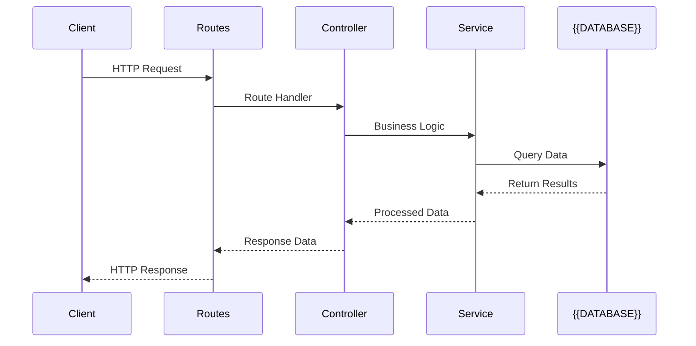

# MVC Request Flow Diagram Template

<!--
  This template generates a Mermaid sequence diagram showing the typical MVC request flow.

  Variables:
  - {{DATABASE}}: Database type (e.g., "PostgreSQL", "SQLite", "MongoDB")
  - {{FRAMEWORK}}: Backend framework name (e.g., "Express", "Fastify", "Koa")

  Usage: Replace variables with actual project values before writing to docs/images/
-->

## Description

This diagram illustrates the typical request flow in an MVC (Model-View-Controller) architecture:

1. **Client** sends an HTTP request to the {{FRAMEWORK}} server
2. **Routes** match the request to the appropriate controller
3. **Controller** delegates business logic to the service layer
4. **Service** performs database operations via the {{DATABASE}} connection
5. Response flows back through the layers to the client

This pattern ensures separation of concerns and maintainable code structure.
