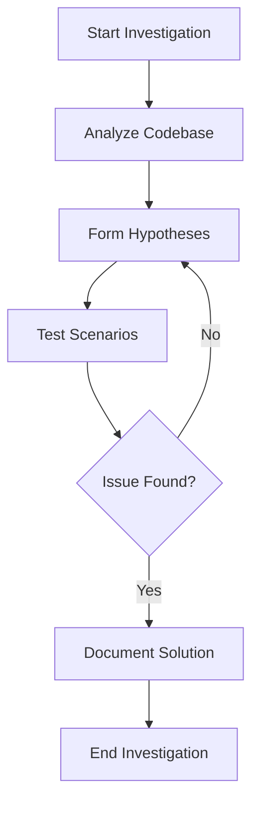

Generate a comprehensive AI-powered investigation plan using the Trinity Method.

**Investigation Planner Process:**

**Step 1: Gather Requirements**
Ask user:
- What needs investigation?
- Known symptoms or issues
- Affected systems/components
- Previous investigation attempts
- Time constraints

**Step 2: Analyze Context**
- Scan relevant codebase sections
- Review related investigations
- Check system dependencies
- Identify complexity factors

**Step 3: Generate Plan**
Using InvestigationPlanner, create:

1. **Investigation Strategy**
   - Recommended approach (breadth-first, depth-first, hybrid)
   - Key focus areas
   - Risk assessment
   - Complexity rating

2. **Phase Breakdown**
   - Phase 1: Discovery & Analysis
   - Phase 2: Hypothesis Formation
   - Phase 3: Testing & Validation
   - Phase 4: Documentation & Recommendations

3. **Resource Estimates**
   - Estimated time: X hours
   - Agent assignments (Aly, AJ, JUNO, etc.)
   - Tools required
   - External dependencies

4. **Task Checklist**
   - [ ] Analyze entry points
   - [ ] Map data flow
   - [ ] Identify edge cases
   - [ ] Test hypotheses
   - [ ] Document findings

**Step 4: Generate Visualizations**
Create Mermaid diagrams:

**Step 5: Risk & Dependency Analysis**
- Potential blockers
- Required permissions/access
- Integration points
- Rollback considerations

**Output:**
Save investigation plan to:
`trinity/investigations/plans/PLAN-{investigation-title}.md`

**Plan Includes:**
- Executive summary
- Detailed phase breakdown
- Mermaid diagrams (flowchart, sequence, timeline)
- Resource allocation
- Success criteria
- Contingency plans

**Interactive Options:**
- Modify plan sections
- Add custom phases
- Assign specific agents
- Create investigation from plan
- Export plan to JSON
